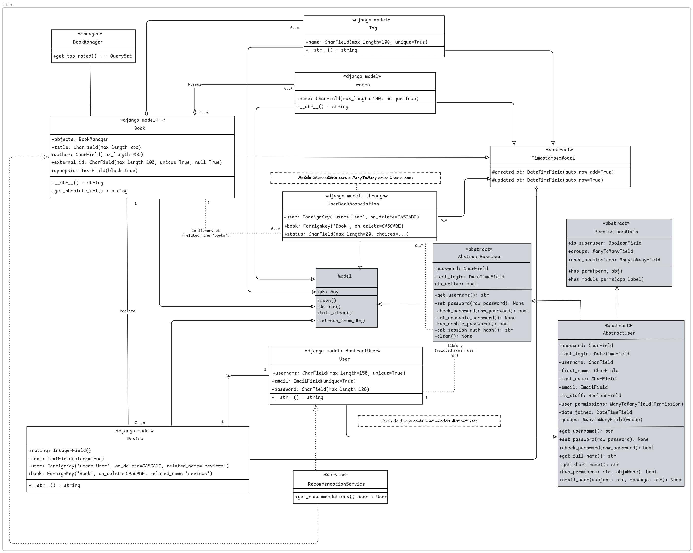

# 2.1.3. Especificação Completa de Arquitetura de Modelos para Django

## 1. Visão Geral

## 1.1. Introdução

Este documento fornece a especificação técnica detalhada para a implementação da camada de modelo (Model Layer) da aplicação "EuRecomendo" utilizando o framework Django. Ele traduz os diagramas de classe em uma estrutura de código Django concreta, servindo como um blueprint para os desenvolvedores.

A arquitetura se baseia em princípios de código limpo, reutilizável e manutenível, como o uso de modelos abstratos (DRY), managers personalizados para lógica de consulta complexa e uma separação clara de responsabilidades.

## 1.2. O que é diagrama de Classes?

O Diagrama de Classes é um tipo de diagrama estrutural da UML (Linguagem de Modelagem Unificada) que oferece uma visão estática da arquitetura de um sistema de software. É considerado a espinha dorsal da modelagem orientada a objetos.

O principal objetivo deste diagrama é modelar os elementos centrais de um sistema, definindo suas classes, interfaces, atributos (dados) e operações (métodos). É importante destacar que ele visualiza de forma clara os relacionamentos entre essas classes: associação, generalização (herança) e dependência.

## 1.3 Diagrama de Classes


<p style="text-align: center"> Diagrama de Classes - EuRecomendo </p>


<font size="3"><p style="text-align: center">Autores: [Pedro Braga](https://github.com/Stain19), [Gabriel Castelo](https://github.com/GabrielCastelo-31), [Renan Vieira](https://github.com/R-enanVieira) e [Bruno Bragança](https://github.com/BrunoBReis)  2025.</p></font>

---
## 2. Modelo Base
### 2.1. Classe: `Model`
-   **Descrição:** Modelo base do qual quase todas as outras classes de um projeto Django herdam. Fornece funcionalidades comuns e padrões para todos os modelos.

#### Atributos (Campos)
| Nome do Atributo | Tipo de Campo Django | Parâmetros | Descrição |
|:---|:---|:---|:---|
|`pk` | `Any` | Gerenciado pelo Django | Chave primária única para cada registro. |

#### Métodos
| Assinatura do Método | Visibilidade | Descrição |
| :--- | :--- | :--- |
| `def save(self, *args, **kwargs) -> None:` | pública | Salva o modelo no banco de dados. Cria um novo registro ou atualiza um existente. |
| `def delete(self, *args, **kwargs) -> tuple:` | pública | Remove o registro do banco de dados e retorna informações sobre a exclusão. |
| `def full_clean(self) -> None:` | pública | Executa validação completa do modelo, incluindo validação de campos e validação personalizada. |
| `def refresh_from_db(self, using=None, fields=None) -> None:` | pública | Recarrega os dados do modelo a partir do banco de dados, atualizando os campos do objeto. |


## 3. Modelos Abstratos (App `core`)

### 3.1. Classe: `TimestampedModel`

-   **Descrição:** Modelo abstrato base que adiciona campos de timestamp de criação e atualização a todos os modelos concretos que o herdam. Garante um padrão de auditoria consistente em todo o sistema.
-   **Herança:** `django.db.models.Model`
-   **Meta:** `abstract = True`

#### Atributos (Campos)

| Nome do Atributo | Tipo de Campo Django        | Parâmetros                                                                 | Descrição                                                                |
| :--------------- | :-------------------------- | :------------------------------------------------------------------------- | :----------------------------------------------------------------------- |
| `created_at`     | `models.DateTimeField`      | `verbose_name="Criado em"`, `auto_now_add=True`                            | Data e hora em que o registro foi criado. Preenchido automaticamente.    |
| `updated_at`     | `models.DateTimeField`      | `verbose_name="Atualizado em"`, `auto_now=True`                          | Data e hora da última atualização do registro. Atualizado automaticamente. |

---

### 3.2. Classe: `AbstractBaseUser`

-   **Descrição:** Modelo abstrato base do Django que fornece a implementação central de autenticação, incluindo hash de senha e gestão de sessões, mas sem nenhum campo de usuário pré-definido. É a escolha para cenários que exigem controle total sobre a estrutura do modelo de usuário.
-   **Herança:** `django.db.models.Model`

#### Atributos (Campos)

| Nome do Atributo | Tipo de Campo Django | Parâmetros | Descrição |
|:---|:---|:---|:---|
| `password` | `CharField` | | Hash da senha do usuário. |
| `last_login` | `DateTimeField` | | Data e hora do último login do usuário. |
| `is_active` | `BooleanField` | | Booleano indicando se a conta do usuário está ativa. |

#### Métodos

| Assinatura do Método | Visibilidade | Descrição |
| :--- | :--- | :--- |
| `def get_username(self) -> str:` | pública | Retorna o campo usado como identificador único. |
| `def set_password(self, raw_password: str) -> None:` | pública | Define a senha do usuário, aplicando o hash. |
| `def check_password(self, raw_password: str) -> bool:` | pública | Verifica se a senha fornecida corresponde à senha armazenada. |
| `def set_unusable_password(self) -> None:` | pública | Marca a senha do usuário como inutilizável. |
| `def has_unusable_password(self) -> bool:` | pública | Verifica se a senha do usuário está marcada como inutilizável. |
| `def get_session_auth_hash(self) -> str:` | pública | Retorna o hash de autenticação da sessão. |
| `def clean(self) -> None:` | pública | Executa a validação do modelo. |

---
### 3.3. Classe: `AbstractUser`

**Descrição:** Modelo abstrato base padrão do Django para customização do modelo de usuário. Permite a extensão do modelo de usuário padrão com campos adicionais conforme necessário.

* **Heranças:** `django.db.models.Model` e `django.contrib.auth.models.PermissionsMixin`
* **Meta:** `abstract = True`

#### Atributos (Campos)

| Nome do Atributo | Tipo de Campo Django      | Parâmetros Chave                                    | Descrição                                                                      |
| :--------------- | :------------------------ | :-------------------------------------------------- | :----------------------------------------------------------------------------- |
| `password`       | `models.CharField`        | `max_length=128`, `verbose_name='password'`         | Hash da senha do usuário. O Django gerencia a criptografia automaticamente.   |
| `last_login`     | `models.DateTimeField`    | `blank=True`, `null=True`, `verbose_name='last login'` | Data e hora do último login do usuário. Pode ser nulo se nunca fez login.    |
| `username`       | `models.CharField`        | `max_length=150`, `unique=True`, `verbose_name='username'` | Nome de usuário único para identificação e login.                           |
| `first_name`     | `models.CharField`        | `max_length=150`, `blank=True`, `verbose_name='first name'` | Primeiro nome do usuário. Campo opcional.                                   |
| `last_name`      | `models.CharField`        | `max_length=150`, `blank=True`, `verbose_name='last name'` | Sobrenome do usuário. Campo opcional.                                       |
| `email`          | `models.EmailField`       | `blank=True`, `verbose_name='email address'`        | Endereço de e-mail do usuário. Campo opcional no modelo base.                |
| `is_staff`       | `models.BooleanField`     | `default=False`, `verbose_name='staff status'`      | Define se o usuário pode acessar o site de administração do Django.          |
| `is_active`      | `models.BooleanField`     | `default=True`, `verbose_name='active'`             | Define se a conta do usuário está ativa. Contas inativas não podem fazer login. |
| `date_joined`    | `models.DateTimeField`    | `default=timezone.now`, `verbose_name='date joined'` | Data e hora em que a conta do usuário foi criada.                           |

#### Métodos

| Assinatura do Método                              | Visibilidade | Descrição                                                                        |
| :------------------------------------------------ | :----------- | :------------------------------------------------------------------------------- |
| `def get_username(self) -> str:`                  | pública      | Retorna o valor do campo usado para identificar unicamente o usuário.           |
| `def set_password(self, raw_password: str) -> None:` | pública   | Define a senha do usuário, aplicando o hash automaticamente.                    |
| `def check_password(self, raw_password: str) -> bool:` | pública  | Verifica se a senha fornecida corresponde à senha armazenada do usuário.        |
| `def get_full_name(self) -> str:`                 | pública      | Retorna o nome completo do usuário (first_name + last_name).                    |
| `def get_short_name(self) -> str:`                | pública      | Retorna o primeiro nome do usuário.                                             |

### 3.4. PermissionsMixin
-   **Descrição:** Mixin que adiciona suporte a permissões e grupos ao modelo de usuário. Permite a atribuição de permissões específicas e a associação a grupos de usuários.

#### Atributos (Campos)
| Nome do Atributo | Tipo de Campo Django | Parâmetros | Descrição |
|:---|:---|:---|:---|
| `is_superuser` | `models.BooleanField` | `default=False`, `verbose_name='superuser status'` | Define se o usuário tem todas as permissões sem precisá-las atribuir explicitamente. |

#### Relacionamentos

| Nome do Atributo | Tipo de Campo Django | Parâmetros | Descrição |
|:---|:---|:---|:---|
| `groups` | `models.ManyToManyField` | `to='auth.Group'`, `blank=True`, `related_name='user_set'` | Grupos aos quais este usuário pertence. Um usuário receberá todas as permissões concedidas a cada um de seus grupos. |
| `user_permissions` | `models.ManyToManyField` | `to='auth.Permission'`, `blank=True`, `related_name='user_set'` | Permissões específicas para este usuário. |

#### Métodos

| Assinatura do Método | Visibilidade | Descrição |
| :--- | :--- | :--- |
| `def has_perm(self, perm: str, obj=None) -> bool:` | pública | Verifica se o usuário tem uma permissão específica. Retorna True se o usuário tem a permissão. |
| `def has_module_perms(self, app_label: str) -> bool:` | pública | Verifica se o usuário tem alguma permissão no aplicativo especificado. |


## 4. Modelos da Aplicação `users`

### 4.1. Classe: `User`

-   **Descrição:** Modelo customizado que estende o usuário padrão do Django. Centraliza todas as informações e autenticação do usuário.
-   **Herança:** `django.contrib.auth.models.AbstractUser`

#### Atributos (Campos do `AbstractUser` a serem considerados)

| Nome do Atributo | Tipo de Campo Django      | Parâmetros Chave                                    | Descrição                                                                      |
| :--------------- | :------------------------ | :-------------------------------------------------- | :----------------------------------------------------------------------------- |
| `username`       | `models.CharField`        | `max_length=150`, `unique=True`, `...`              | Nome de usuário único para login.                                              |
| `email`          | `models.EmailField`       | `unique=True`, `verbose_name='endereço de e-mail'`  | Endereço de e-mail único. Pode ser usado para login e recuperação de senha.    |
| `password`       | `models.CharField`        | Gerenciado pelo Django (armazena o hash)            | Hash da senha do usuário. O Django gerencia a criptografia.                    |
| `first_name`     | `models.CharField`        | `max_length=150`, `blank=True`                      | Primeiro nome do usuário. Opcional.                                            |
| `last_name`      | `models.CharField`        | `max_length=150`, `blank=True`                      | Sobrenome do usuário. Opcional.                                                |
| `is_staff`       | `models.BooleanField`     | `default=False`                                     | Define se o usuário pode acessar o painel de administração do Django.          |
| `is_active`      | `models.BooleanField`     | `default=True`                                      | Define se a conta do usuário está ativa. Contas inativas não podem fazer login. |
| `date_joined`    | `models.DateTimeField`    | `default=timezone.now`                              | Data e hora em que a conta do usuário foi criada.                              |


#### Relacionamentos

| Nome do Atributo | Tipo de Campo Django         | Parâmetros                                                                                     | Descrição                                                                                             |
| :--------------- | :--------------------------- | :--------------------------------------------------------------------------------------------- | :---------------------------------------------------------------------------------------------------- |
| `library`        | `models.ManyToManyField`     | `to='books.Book'`, `through='books.UserBookAssociation'`, `related_name='users_in_library'`    | Relação muitos-para-muitos com `Book` que representa a biblioteca do usuário, com status de leitura. |

#### Métodos

| Assinatura do Método              | Visibilidade | Descrição                                        |
| :--------------------------------- | :----------- | :----------------------------------------------- |
| `def __str__(self) -> str:`        | pública      | Retorna o `username` do usuário.                 |

---

## 5. Modelos da Aplicação `books`

### 5.1. Classe: `Genre`

-   **Descrição:** Modela uma categoria ou gênero literário (ex: Ficção Científica, Fantasia).
-   **Herança:** `core.models.TimestampedModel`

#### Atributos (Campos)

| Nome do Atributo | Tipo de Campo Django | Parâmetros                                 | Descrição                    |
|:---------------|:---------------------|:-------------------------------------------|:-----------------------------|
| `name` | `models.CharField` | `max_length=100`, `unique=True`, `verbose_name="Nome"`| Nome único do gênero literário. |

#### Métodos

| Assinatura do Método              | Visibilidade | Descrição                |
| :--------------------------------- | :----------- | :----------------------- |
| `def __str__(self) -> str:`        | pública      | Retorna `self.name`.     |

### 5.2. Classe: `Tag`

-   **Descrição:** Modela uma palavra-chave ou "tag" que pode ser associada a um livro para fins de categorização mais granular.
-   **Herança:** `core.models.TimestampedModel`

#### Atributos (Campos)

| Nome do Atributo | Tipo de Campo Django | Parâmetros                                 | Descrição                  |
|:---------------|:---------------------|:-------------------------------------------|:---------------------------|
| `name` | `models.CharField` | `max_length=100`, `unique=True`, `verbose_name="Nome"`| Nome único da tag ou palavra-chave. |

#### Métodos

| Assinatura do Método              | Visibilidade | Descrição                |
| :--------------------------------- | :----------- | :----------------------- |
| `def __str__(self) -> str:`        | pública      | Retorna `self.name`.     |

### 5.3. Classe: `Book`

-   **Descrição:** Entidade central do sistema, representando um livro com suas informações básicas.
-   **Herança:** `core.models.TimestampedModel`

#### Atributos (Campos)

| Nome do Atributo | Tipo de Campo Django     | Parâmetros                                                                       | Descrição                                                                                           |
|:---------------|:-------------------------|:---------------------------------------------------------------------------------|:----------------------------------------------------------------------------------------------------|
| `title` | `models.CharField`     | `max_length=255`, `verbose_name="Título"`                                      | Título oficial do livro.                                                                            |
| `author` | `models.CharField`     | `max_length=255`, `verbose_name="Autor"`                                       | Nome do autor ou autores do livro.                                                                  |
| `external_id` | `models.CharField`     | `max_length=100`, `unique=True`, `null=True`, `blank=True`, `verbose_name="ID Externo"` | Identificador único de uma API externa (ex: Google Books ID) para evitar duplicidade de livros. Opcional. |
| `synopsis` | `models.TextField`       | `null=True`, `blank=True`, `verbose_name="Sinopse"`                            | Resumo ou sinopse do livro. Opcional.                                                               |

#### Relacionamentos

| Nome do Atributo | Tipo de Campo Django       | Parâmetros                                           | Descrição                                                |
|:---------------|:-------------------------|:-----------------------------------------------------|:---------------------------------------------------------|
| `genres` | `models.ManyToManyField`   | `to='Genre'`, `related_name='books'`, `verbose_name="Gêneros"`| Relação muitos-para-muitos com os gêneros do livro.    |
| `tags` | `models.ManyToManyField`   | `to='Tag'`, `related_name='books'`, `verbose_name="Tags"`    | Relação muitos-para-muitos com as tags associadas ao livro. |

#### Métodos

| Assinatura do Método                        | Visibilidade | Descrição                                                           |
| :------------------------------------------- | :----------- | :------------------------------------------------------------------ |
| `def __str__(self) -> str:`                  | pública      | Retorna uma string no formato `"Título do Livro por Autor"`.       |
| `def get_average_rating(self) -> float:`     | pública      | `@property` que calcula e retorna a nota média das avaliações.      |


### 5.4. Classe: `Review`

-   **Descrição:** Representa a avaliação de um livro, contendo uma nota e um texto, feita por um usuário.
-   **Herança:** `core.models.TimestampedModel`

#### Atributos (Campos)

| Nome do Atributo| Tipo de Campo Django | Parâmetros | Descrição |
|:---|:---|:---|:---|
| `rating` | `models.IntegerField` | `validators=[MinValueValidator(1), MaxValueValidator(5)]`, `verbose_name="Nota"` | Nota da avaliação, restrita a um valor inteiro entre 1 e 5. |
| `text` | `models.TextField` | `null=True`, `blank=True`, `verbose_name="Resenha"` | Texto da resenha, de tamanho livre. Opcional. |

#### Relacionamentos

| Nome do Atributo| Tipo de Campo Django | Parâmetros | Descrição |
|:---|:---|:---|:---|
| `user` | `models.ForeignKey` | `to='users.User'`, `on_delete=models.CASCADE`, `related_name='reviews'`, `verbose_name="Usuário"` | Chave estrangeira para o usuário que fez a avaliação. Se o usuário for excluído, a avaliação também será. |
| `book` | `models.ForeignKey` | `to='Book'`, `on_delete=models.CASCADE`, `related_name='reviews'`, `verbose_name="Livro"` | Chave estrangeira para o livro que está sendo avaliado. Se o livro for excluído, a avaliação também será. |


#### Métodos e Meta

| Assinatura do Método | Visibilidade | Descrição |
| :--- | :--- | :--- |
| `def __str__(self) -> str:` | pública | Retorna `"Avaliação de [Usuário] para [Livro]"`. |

-   **`class Meta:`**
    -   `unique_together = ['user', 'book']`: Impede que um usuário avalie o mesmo livro mais de uma vez.

### 5.5. Classe: `UserBookAssociation`

-   **Descrição:** Modelo intermediário ("through model") que conecta `User` e `Book`, representando a "biblioteca" de um usuário e armazenando o status da leitura.
-   **Herança:** `core.models.TimestampedModel`

#### Enum de Status

```python
class StatusChoices(models.TextChoices):
    WANT_TO_READ = 'WANT_TO_READ', 'Quero Ler'
    READING = 'READING', 'Lendo'
    READ = 'READ', 'Lido'
```

#### Atributos (Campos)

| Nome do Atributo      | Tipo de Campo Django      | Parâmetros                                                                         | Descrição                                                                      |
|:----------------------|:--------------------------|:-----------------------------------------------------------------------------------|:-------------------------------------------------------------------------------|
| `status`              | `models.CharField`        | `max_length=20`, `choices=StatusChoices.choices`, `default=StatusChoices.WANT_TO_READ`| Status da leitura do livro pelo usuário (ex: 'Lido', 'Lendo', 'Quero Ler'). |

#### Relacionamentos

| Nome do Atributo | Tipo de Campo Django | Parâmetros | Descrição |
|:---------------|:---------------------|:--------------------------------------------------------------------------------------------|:---|
| `user` | `models.ForeignKey` | `to='users.User'`, `on_delete=models.CASCADE`, `related_name='library_associations'` | Chave estrangeira para o usuário. |
| `book` | `models.ForeignKey` | `to='Book'`, `on_delete=models.CASCADE`, `related_name='library_associations'` | Chave estrangeira para o livro. |

---

## 6. Classes de Serviço

### 6.1. Classe: `RecommendationService`

-   **Descrição:** Classe não persistida, responsável por encapsular a lógica de negócio para geração de recomendações de livros.
-   **Atributos:** Nenhum
-   **Métodos:**

| Assinatura do Método | Retorno | Descrição |
|:---|:---|:---|
| `def get_recommendations(self, user: 'User') -> QuerySet['Book']:` | `QuerySet` de `Book` | Gera e retorna uma lista de livros recomendados para um determinado usuário, com base em seu histórico, avaliações e gêneros de preferência. |

## Bibliografia

> Fonte: SERRANO, Milene. **Módulo Notação UML - Modelagem Estática**. Unb, 2025.

## Autores

| Nome                      |
|---------------------------|
| [Bruno Bragança](https://github.com/BrunoBReis) |
| [Gabriel Castelo](https://github.com/GabrielCastelo-31)   |
| [Pedro Braga](https://github.com/Stain19) |
| [Renan Vieira](https://github.com/R-enanVieira) |

## Histórico de Versionamento

| Versão | Data  | Descrição | Autor(es) | Revisor(es) |
|--------|-------|-----------|-----------|-------------|
|  `1.0` | 17/09 | Adiciona descricao de classes e respectivos atributos e metodos | [Pedro Braga](https://github.com/Stain19), [Gabriel Castelo](https://github.com/GabrielCastelo-31) e [Renan Vieira](https://github.com/R-enanVieira) | [Bruno Bragança](https://github.com/BrunoBReis) |
|  `1.1` | 18/09 | Adicionando uma introdução e corrigindo o diagrama com nova Classe e adicionando bibliografia | [Bruno Bragança](https://github.com/BrunoBReis) | [Pedro Braga](https://github.com/Stain19) |
| `1.2` | 21/09 | Adicionando classes padrões do Django e corrijindo erros de escrita | [Gabriel Castelo](https://github.com/GabrielCastelo-31) | [Bruno Bragança](https://github.com/BrunoBReis) |
|  `1.3` | 21/09 | Corrige numeracao de topicos, formatacao e modifica classe PermissionMixin | [Pedro Braga](https://github.com/Stain19) | [Bruno Bragança](https://github.com/BrunoBReis) |
|  `1.4` | 21/09 | Adiciona a classe AbstractBaseUser | [Pedro Braga](https://github.com/Stain19) | [Bruno Bragança](https://github.com/BrunoBReis) |