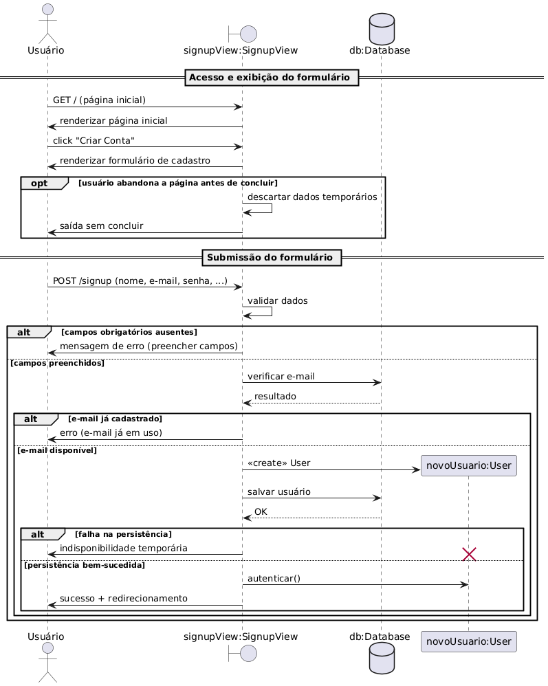

# 2.2.1 Diagrama de Sequência

## O que é Diagrama de Sequência

 &emsp;&emsp;O diagrama de sequência ilustra a interação entre objetos em um sistema, com ênfase na ordem cronológica em que as mensagens são trocadas. Ele captura o comportamento dinâmico de um cenário específico, mostrando como diferentes partes de um sistema colaboram para realizar uma funcionalidade, respondendo à pergunta: "Quem faz o quê e quando?".

## Diagramas de Sequência do Projeto Eu Recomendo

Abaixo estão os diagramas de sequência que representam os principais casos de uso do sistema "Eu Recomendo". Cada diagrama detalha a interação entre os atores (usuários) e o sistema, destacando a sequência de mensagens trocadas para alcançar os objetivos definidos nos casos de uso.

## Diagrama de Sequência - UC01: Criar Conta

<b>Imagem 1</b> - Diagrama de Sequência - UC01: Criar Conta  

Fonte: [Gabriel Castelo](https://github.com/GabrielCastelo-31), 2025.

## Diagrama de Sequência - UC02: Editar Conta

<b>Imagem 2</b> - Diagrama de Sequência - UC01: Criar Conta  

Fonte: [Gabriel Castelo](https://github.com/GabrielCastelo-31), 2025.

## Diagrama de Sequência - UC04: Pesquisar Livro

<b>Imagem 3</b> - Diagrama de Sequência - UC04: Pesquisar Livro  

Fonte: [Sophia Silva](https://github.com/Sophiassilva) 2025.

## Diagrama de Sequência - UC05: Fazer avaliação de livro

<b>Imagem 4</b> - Diagrama de Sequência - UC05: Fazer avaliação de livro  

Fonte: [Renan Vieira](https://github.com/R-enanVieira) 2025.

## Bibliografia

> Curso de UML - Diagrama de Sequência UML - Exemplo Básico - Bóson Treinamentos; Disponível em: [https://www.youtube.com/watch?v=LeV6RO-6Tn4](https://www.youtube.com/watch?v=LeV6RO-6Tn4). Acesso em: 20 set. 2025.

---

## Participantes

| Nome                      |
|---------------------------|
| [Gabriel Castelo](https://github.com/GabrielCastelo-31)|
| [Sophia Silva](https://github.com/Sophiassilva)   |
| [Renan Vieira](https://github.com/R-enanVieira) |

## Histórico de Versionamento

| Versão | Data  | Descrição | Autor(es) | Revisor(es) |
|--------|-------|-----------|-----------|-------------|
|  `0.1` | 20/09 | Adição da estrutura do arquivo | [Sophia Silva](https://github.com/Sophiassilva)  | [Gabriel Castelo](https://github.com/GabrielCastelo-31) |
|  `0.2` | 20/09 | Adição do diagrama de sequência de Pesquisar Livro | [Sophia Silva](https://github.com/Sophiassilva)  | [Gabriel Castelo](https://github.com/GabrielCastelo-31) |
|  `0.3` | 21/09 | Adição do diagrama de sequência de Fazer avaliação de livro | [Renan Vieira](https://github.com/R-enanVieira)  | [Sophia Silva](https://github.com/Sophiassilva) |
| `0.4` | 21/09 | Adição dos diagramas de sequência de Criar Conta e Editar Conta |[Gabriel Castelo](https://github.com/GabrielCastelo-31) | [Sophia Silva](https://github.com/Sophiassilva) |
