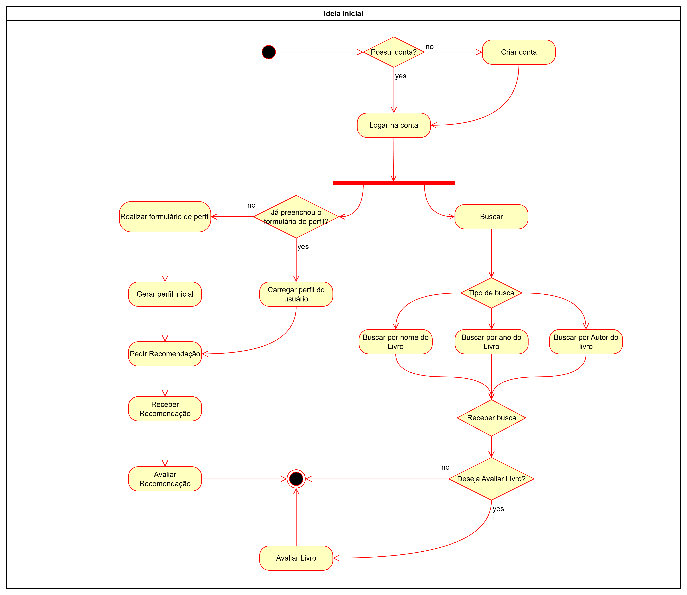
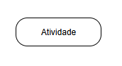
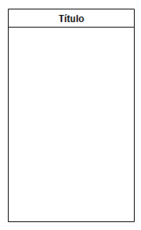

# 2.2.2 Diagrama de Atividades

## O que é Diagrama de Atividades?

O **Diagrama de Atividades UML** é um tipo de diagrama comportamental da UML (Unified Modeling Language), utilizado para representar visualmente os fluxos de trabalho (workflows) de um sistema, processo de negócio ou operação. Essencialmente, ele funciona como um fluxograma detalhado que ilustra a sequência de atividades e o fluxo de controle de uma etapa para outra.

Este diagrama é focado na perspectiva dinâmica do sistema, ou seja, ele descreve o que acontece e em que ordem. Ele é eficaz para modelar a lógica de um processo, mostrando as etapas sequenciais, as condições que determinam diferentes caminhos (decisões), as atividades que podem ocorrer em paralelo (processos simultâneos) e a sincronização de diferentes fluxos.

## Metodologia 

Primeiramente foi feito uma abordagem mais geral e ampla de como seria o fluxo de atividades de todo o produto. Porém, logo se percebeu que seria de difícil visualização e confecção. Mas vale ressaltar a sua importância para a confecção de divisão das próximas etapas

*Figura 0: Diagrama de Atividades do Sistema Geral - Desenvolvido por Bruno Bragança e Euller Júlio*

Para a construção deste artefato, foi estabelecida uma metodologia de trabalho que visa garantir a consistência e a precisão dos diagramas de atividades que modelam os fluxos do sistema. A abordagem adotada seguiu os seguintes critérios:

**1. Análise e Escopo**

Cada fluxo de processo foi mapeado com base nas funcionalidades e interações já prototipadas em diagramas anteriores, garantindo que o processo fosse representado da forma mais fiel o comportamento esperado do sistema.

**2. Padrão de Notação**

Para a elaboração dos diagramas, foi adotada a notação padrão da UML (Unified Modeling Language). Essa escolha assegura uma representação universalmente compreendida e tecnicamente precisa dos fluxos de trabalho, utilizando seus elementos específicos.

**3. Ferramenta Utilizada**

A ferramenta selecionada para a criação e edição dos diagramas foi o Draw.io, permitindo colaboração em tempo real e versionamento adequado dos diagramas.

**4. Processo de Trabalho e Colaboração**

A elaboração dos diagramas foi um esforço colaborativo, com a responsabilidade distribuída entre os membros da equipe para otimizar a produtividade e garantir a cobertura completa do sistema. A divisão de tarefas foi organizada da seguinte forma:

**Responsáveis pela elaboração**: Bruno Bragança, Euller Julio, Jose Eduardo Prado e Tiago Balieiro.

**Distribuição por Funcionalidade**:
- **Fluxo de Login/Cadastro** - [Bruno Bragança](https://github.com/BrunoBReis) *(A completar)*
- **Fluxo de Pesquisa/Busca** - [Jose Eduardo Prado](https://github.com/jevprado) *(A completar)*
- **Fluxo de Avaliação de Livros** - [Euller Júlio](https://github.com/Potatoyz908)
- **Fluxo de Formulário/Perfil** - [Tiago Balieiro](https://github.com/TiagoBalieiro) *(A completar)*

Cada membro ficou responsável por desenvolver e modelar um fluxo específico do sistema, trabalhando em conjunto para garantir a coesão e a integração entre os diferentes diagramas.

## Componentes do Diagrama de Atividades

Os principais componentes de um Diagrama de Atividades incluem:

| Representação | Nomenclatura | Descrição |
| ----------- | --- | --- |
| | **Nó Inicial** | Representa o ponto de partida do fluxo.  |
| | **Nó Final** | Representa o término do fluxo. |
| | **Ação/Atividade** | Uma etapa ou tarefa dentro do fluxo.  |
|  | **Fluxo de Controle**| Setas que conectam as atividades, indicando a direção do fluxo. |
| | **Nó de Decisão** | Um ponto onde o caminho se divide com base em uma condição (guarda).  |
| | **Nó de Junção (Merge)** | Unifica diferentes fluxos de decisão em um único fluxo. |
| | **Nó de Bifurcação (Fork)** | Divide um único fluxo em múltiplos fluxos paralelos ou concorrentes. |
| | **Nó de Sincronização (Join)** | Sincroniza múltiplos fluxos paralelos em um único fluxo, aguardando que todos os fluxos de entrada sejam concluídos para prosseguir. |
| | **Raias (Swimlanes)** | Opcionais, são usadas para organizar as atividades por responsabilidade, indicando qual ator, departamento ou sistema é responsável por cada etapa do processo. |

## Diagramas de Atividades Desenvolvidos

### 1. Diagrama de Atividades - Fluxo de Avaliação de Livros

**Responsável**: [Euller Júlio](https://github.com/Potatoyz908)

#### Descrição do Fluxo

O diagrama de atividades de avaliação modela o processo completo de avaliação de um livro pelo usuário no sistema EuRecomendo. Este fluxo é fundamental para o sistema de recomendação, pois alimenta continuamente o algoritmo de machine learning com feedback dos usuários.

#### Características do Diagrama

O diagrama apresenta um fluxo sequencial que inicia quando o usuário opta por avaliar um livro e termina com o processamento da avaliação pelo sistema. As principais características incluem:

- **Entrada**: Usuário visualiza lista de livros ou detalhes de um livro específico
- **Processo Principal**: Avaliação estruturada com múltiplos campos
- **Saída**: Confirmação da avaliação e retorno ao fluxo principal

#### Elementos Principais do Fluxo

1. **Início**: Usuário clica em "Avaliar" em um livro
2. **Seleção de Nota**: Atribuição obrigatória de 1-5 estrelas
3. **Recomendação para Categoria**: Indicação se recomenda o livro para a categoria
4. **Resenha Textual**: Campo opcional para comentários detalhados
5. **Validação**: Verificação se campos obrigatórios foram preenchidos
6. **Confirmação**: Exibição de mensagem de sucesso
7. **Finalização**: Fechamento dos detalhes do livro

#### Pontos de Decisão

O diagrama inclui três pontos de decisão principais:

- **Clicou no card?**: Determina se o usuário quer continuar navegando ou avaliar
- **Deseja avaliar?**: Confirma a intenção de realizar avaliação
- **Submeteu avaliação?**: Valida se todos os campos obrigatórios foram preenchidos

#### Fluxos Alternativos

- **Continuar navegando**: Usuário pode prosseguir explorando outros livros
- **Cancelar avaliação**: Possibilidade de abandonar o processo a qualquer momento
- **Correção de dados**: Retorno ao formulário em caso de campos inválidos

#### Aspectos Técnicos

- **Validação em tempo real**: Campos obrigatórios verificados antes do envio
- **Persistência**: Dados salvos no banco para alimentar algoritmo de recomendação
- **Feedback imediato**: Confirmação visual para o usuário
- **Integração**: Conexão direta com sistema de recomendação personalizada

*Figura 1: Diagrama de Atividades do Fluxo de Avaliação de Livros - Desenvolvido por Euller Júlio*

### 2. Diagrama de Atividades - Fluxo de Login/Cadastro

**Responsável**: [Bruno Bragança](https://github.com/BrunoBReis)

### Descrição do Fluxo de Autenticação e Cadastro

O conjunto de diagramas modela o fluxo completo de autenticação de um usuário no sistema, abrangendo tanto o processo de **Login** para usuários existentes quanto o de **Cadastro** para novos usuários. Este fluxo representa o portal de entrada da aplicação, sendo crucial para a segurança e para a personalização da experiência do usuário.

#### Características do Diagrama

Os diagramas apresentam dois fluxos interligados que começam a partir da tela inicial de login e terminam com o usuário acessando a tela principal do sistema ou recebendo feedback sobre erros.

-   **Entrada**: Usuário interage com a tela de Login inicial.
-   **Processo Principal**: Validação de credenciais para usuários existentes ou coleta e validação de dados para novas contas, com um passo opcional para preenchimento de perfil.
-   **Saída**: Acesso à tela principal da aplicação ou redirecionamento para correção de dados.

#### Elementos Principais do Fluxo (Combinado)

1.  **Início**: O fluxo começa com a exibição da tela de Login.
2.  **Decisão de Acesso**: O sistema verifica se o usuário já possui uma conta.
3.  **Fluxo de Login**: Se o usuário tiver uma conta, ele preenche o formulário, envia os dados e o sistema valida as credenciais.
4.  **Fluxo de Cadastro**: Se o usuário não tiver uma conta, ele é redirecionado para a tela de Registro, preenche um formulário e o sistema valida os dados inseridos.
5.  **Configuração de Perfil (Opcional)**: Após um cadastro bem-sucedido, o usuário tem a opção de preencher um formulário de perfil mais detalhado.
6.  **Acesso Concedido**: Após um login ou cadastro bem-sucedido, o usuário é direcionado para a tela principal.
7.  **Finalização**: O processo de autenticação ou cadastro é concluído.

#### Pontos de Decisão

O fluxo combinado possui quatro pontos de decisão principais:

-   **Usuário tem conta?**: Define se o usuário seguirá para o fluxo de Login ou de Cadastro.
-   **Credenciais válidas?**: No fluxo de Login, verifica se os dados fornecidos correspondem a um usuário registrado e concede ou nega o acesso.
-   **Registro correto?**: No fluxo de Cadastro, valida se os dados do formulário de registro são válidos para a criação de uma nova conta.
-   **Deseja preencher o perfil?**: Após o cadastro, permite que o usuário opte por detalhar seu perfil imediatamente ou prosseguir para a tela principal.

#### Fluxos Alternativos

-   **Cadastro de Novo Usuário**: O fluxo inteiro de registro é o principal caminho alternativo para um usuário que chega à tela de login pela primeira vez.
-   **Credenciais Inválidas**: Caso o login falhe, o sistema exibe uma mensagem de erro e permite que o usuário tente novamente, retornando ao passo de preenchimento do formulário.
-   **Correção de Dados de Cadastro**: Se os dados fornecidos no formulário de registro forem inválidos, o usuário é redirecionado para a mesma tela para corrigi-los.
-   **Pular Preenchimento do Perfil**: Um novo usuário pode optar por não preencher o formulário de perfil e ser levado diretamente para a tela principal.

#### Aspectos Técnicos

-   **Validação de Dados**: Ambos os formulários (Login e Registro) exigem validação de campos para garantir a integridade dos dados.
-   **Feedback ao Usuário**: O sistema fornece feedback claro e imediato, tanto para sucesso (redirecionamento) quanto para falha (mensagens de erro).
-   **Gerenciamento de Sessão**: Após um login bem-sucedido, uma sessão de usuário deve ser iniciada para manter o usuário autenticado na aplicação.
-   **Modularidade**: Os processos de Login e Cadastro são tratados como fluxos distintos, o que facilita a manutenção e a clareza do sistema.

*Figura 2: Diagrama de Atividades do Fluxo de Login - Desenvolvido por Bruno Bragança*

*Figura 3: Diagrama de Atividades do Fluxo de Registro - Desenvolvido por Bruno Bragança*

### 3. Diagrama de Atividades - Fluxo de Pesquisa/Busca

**Responsável**: [Jose Eduardo Prado](https://github.com/jevprado)

*[Seção a ser preenchida pelo responsável]*

**Descrição a ser adicionada**:
- Descrição do fluxo de busca
- Aplicação de filtros
- Tratamento de resultados
- Diagrama visual
- Otimizações de performance

### 4. Diagrama de Atividades - Fluxo de Formulário/Perfil

**Responsável**: [Tiago Balieiro](https://github.com/TiagoBalieiro)

#### Descrição do Fluxo

O diagrama de atividades do formulário detalha o processo inicial de coleta de dados fornecidos pelo usuário. Esses dados serão usados para aprimorar o sistema de recomendações, gerando recomendações mais personalizadas.

#### Características do Diagrama

O diagrama representa um fluxo simples, no qual o usuário interage com o sistema preenchendo um formulário de perfil com diversas perguntas. Um fluxo alternativo também está presente, caso o usuário opte por não fornecer consentimento para a coleta de seus dados através do formulário. As principais características incluem:

- **Consentimento**: Um nó inicial que solicita ao usuário consentimento para a coleta de dados pelo formuário.
- **Processo Principal**: Exibição de perguntas e coleta de respostas em sequência.
- **Saída**: Confirmação da de envio do formulário e retorno ao fluxo principal.

#### Elementos Principais do Fluxo

1. **Início**: Usuário é direcionado ao formulário após cadastro
2. **Autorização**: Conde permissão para coleta dos dados do usuário
3. **Perguntas**: Exibição de série de perguntas
4. **Validação**: Verificação se campos obrigatórios foram preenchidos
5. **Confirmação**: Exibição de mensagem de sucesso
6. **Finalização**: Redirecionamento para a tela inicial

#### Pontos de Decisão

O diagrama inclui três pontos de decisão:

- **Solicitar consentimento do usuário para coleta de dados**: Solicita permissão para coleta de dados
- **Pergunta preenchida corretamente?**: Verifica se a pergunta foi preenchida corretamente
- **É última pergunta?**: Verifica se o usuário chegou ao fim do formulário

#### Fluxos Alternativos

- **Negação de Permição**: Caso o usuário opte por não conceder permissão para a coleta de dados, ele é direcionado de volta a tela principal.
- **Correção de dados**: Retorno a pergunta em caso de resposta inválida

#### Aspectos Técnicos

- **Validação em tempo real**: Campos obrigatórios verificados antes do envio
- **Persistência**: Dados salvos no banco para alimentar algoritmo de recomendação
- **Feedback imediato**: Confirmação visual para o usuário
- **Segurança e privacidade**: Solicitação de consentimento para coleta de dados (LGPD)

*Figura X: Diagrama de Atividades do Fluxo do Formulário - Desenvolvido por Tiago Balieiro*

## Considerações de Integração

Os diagramas de atividades desenvolvidos pela equipe são complementares e integrados através dos seguintes aspectos:

### Pontos de Conexão

- **Dashboard Principal**: Centro de navegação que conecta todos os fluxos
- **Sistema de Autenticação**: Requisito comum para acesso às funcionalidades
- **Base de Dados**: Compartilhamento de informações entre diferentes fluxos
- **Sistema de Recomendação**: Alimentado principalmente pelo fluxo de avaliação

### Validações Comuns

- **Autenticação de usuário**: Verificação de sessão ativa
- **Tratamento de erros**: Padrões consistentes de feedback
- **Responsividade**: Adaptação para diferentes dispositivos
- **Performance**: Otimização para carregamento rápido

### Métricas de Acompanhamento

- **Taxa de conversão**: Medição de conclusão de cada fluxo
- **Tempo de execução**: Monitoramento da duração dos processos
- **Pontos de abandono**: Identificação de etapas problemáticas
- **Satisfação do usuário**: Feedback sobre usabilidade

## Referencias 

- UML 2.0 Activity Diagrams. Disponível em: https://www.uml-diagrams.org/activity-diagrams.html
- BOOCH, Grady; RUMBAUGH, James; JACOBSON, Ivar. UML: Guia do Usuário. 2ª ed. Rio de Janeiro: Elsevier, 2012.
- SERRANO, Millene. Arquitetura e Desenho de Software – Aula Modelagem UML Dinâmica. Brasília: Universidade de Brasília (UnB), 2025.
- Draw.io Documentation. Disponível em: https://www.drawio.com/doc/ 

## Histórico de Versionamento

| Versão | Data  | Descrição | Autor(es) | Revisor(es) |
|--------|-------|-----------|-----------|-------------|
|  `1.0` | 20/09 | Documentação inicial do Diagrama de Atividades | [Jose Eduardo Prado](https://github.com/jevprado) | [Luis Lima](https://github.com/luidooo), [Henrique Quenino](https://github.com/henriquecq) e [Iago](https://github.com/iagorrr) |
|  `1.1` | 20/09 | Adição do diagrama de avaliação e estruturação para outros fluxos | [Euller Júlio](https://github.com/Potatoyz908) | [Luis Lima](https://github.com/luidooo), [Henrique Quenino](https://github.com/henriquecq) e [Iago](https://github.com/iagorrr) |
|  `1.2` | 20/09 | Adição do diagrama de avaliações (Formulário) e correções de formatação da página | [Tiago Balieiro](https://github.com/tiagobalieiro) | [Euller Júlio](https://github.com/Potatoyz908) |
|  `1.3` | 20/09 | Adição do diagrama de avaliações (Login e Cadastro) e correções de formatação da página | [Bruno Bragança](https://github.com/BrunoBReis) | [Euller Júlio](https://github.com/Potatoyz908) |