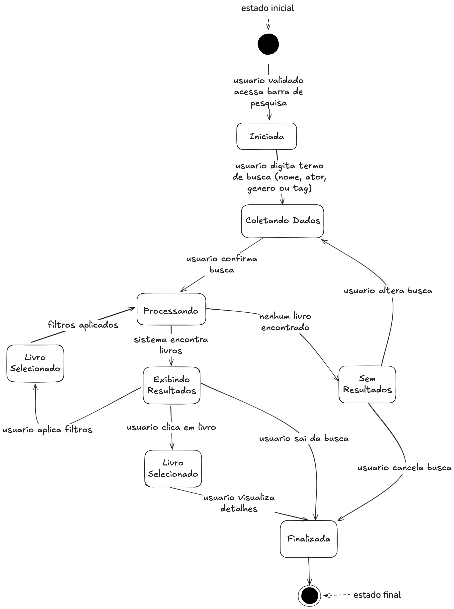
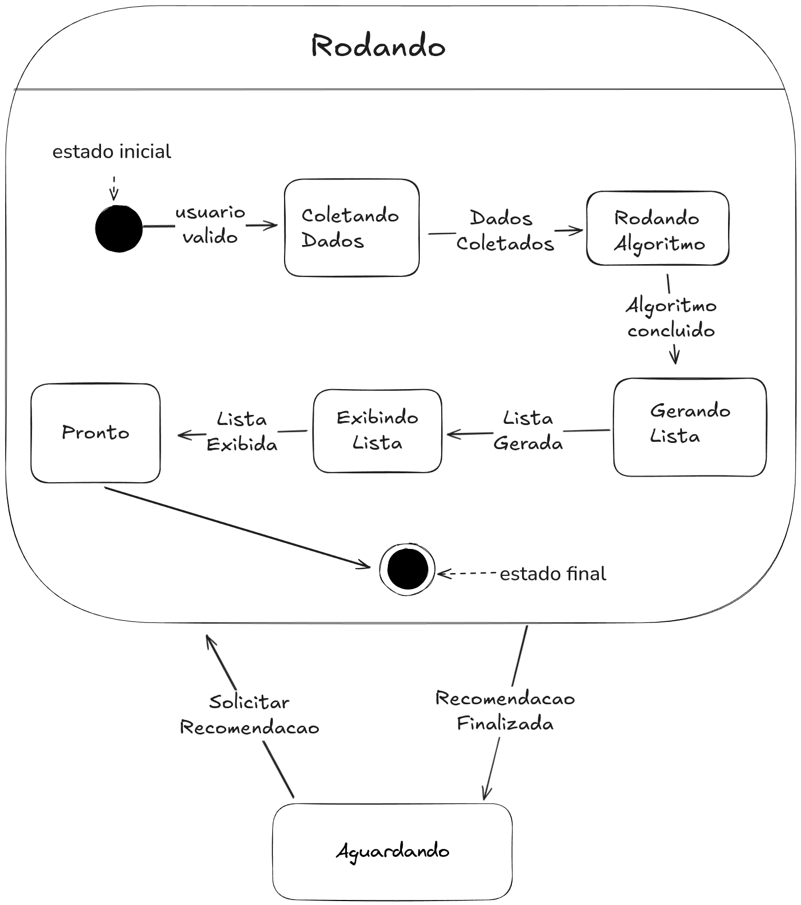
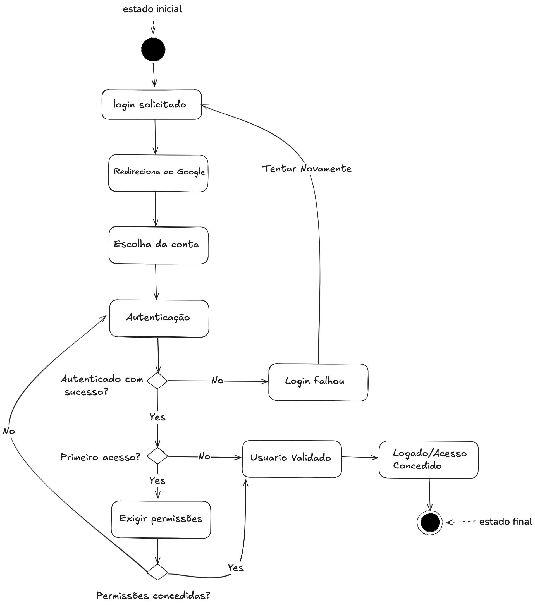
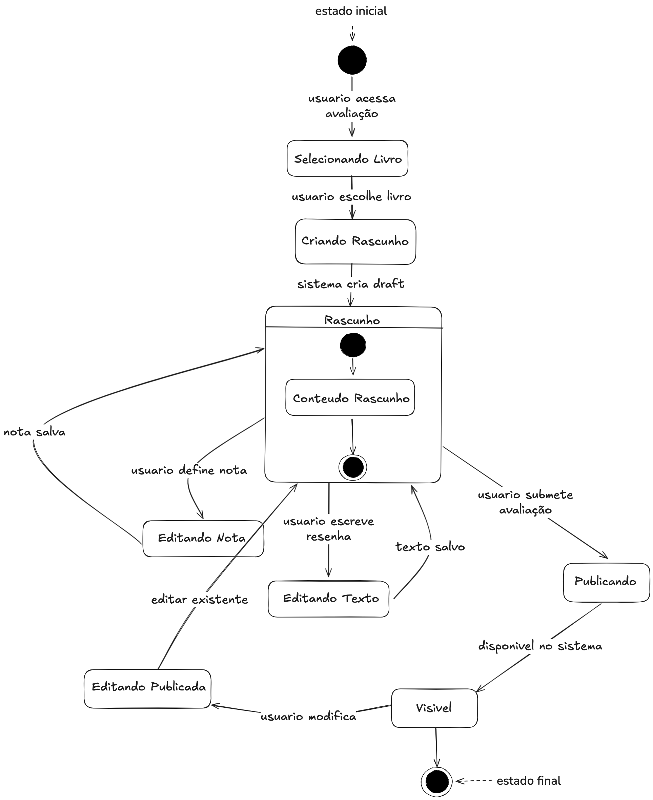
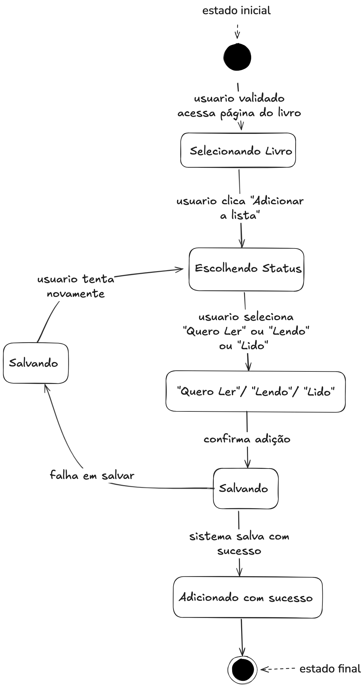

# 2.2.3. Diagrama de Estados

## Introdução

O diagrama de estados é uma categoria de diagrama comportamental UML empregado para representar o ciclo de existência de um objeto no sistema. Ele especifica os diversos estados possíveis de um objeto, assim como os eventos responsáveis pelas mudanças entre esses estados. Esta modelagem é particularmente valiosa para ilustrar comportamentos responsivos e assegurar a coerência nas interações entre os componentes da aplicação.

Esta abordagem de modelagem auxilia na definição das regras de negócio, no mapeamento de cenários críticos e na gestão de transições complexas, como processos de busca, sistemas de recomendação e fluxos de avaliação. Além disso, esclarece o comportamento esperado dos componentes interativos, contribuindo para um desenvolvimento mais estruturado e robusto.

## Metodologia

A construção do diagrama de estados foi desenvolvida através da identificação dos seis principais objetos do sistema: Usuário, Livro, Resenha/Avaliação, Biblioteca Pessoal, Processo de Recomendação e Sessão de Busca. Com base nesses objetos centrais, foram mapeados os fluxos de interação mais relevantes para o funcionamento da plataforma: pesquisa simples de livros, solicitação e geração de recomendações, processo de login/cadastro, realização de avaliações/resenhas e adição de livros nas listas pessoais. Cada diagrama representa os estados possíveis e as transições entre eles para essas funcionalidades. 

## Diagrama

O diagrama de estados contempla os seguintes fluxos:

  
<strong>Diagrama de Estado: Pesquisa simples de livros </strong>

  
<b>Figura 1:</b> Diagrama de Estado - Pesquisa simples de livros 

  

  

  
<b>Autor:</b> Henrique Azevedo, 2025.

• **Pesquisa simples de livros**: Este fluxo representa o processo de busca de livros na plataforma. O usuário inicia no taldo talde taldones 

  
<strong>Diagrama de Estado: Solicitar e Gerar recomendação</strong>

  
<b>Figura 2:</b> Diagrama de Estado - Solicitar e Gerar recomendação

  

  

  
<b>Autor:</b> Luis, 2025.

• **Solicitar e Gerar recomendação**: Este fluxo representa o processo completo de geração de recomendações personalizadas na plataforma. O usuário válido inicia o processo, transitando para "Coletando Dados" onde o sistema reúne informações do perfil do usuário. Em seguida, os "Dados Coletados" são processados e o fluxo evolui para "Rodando Algoritmo", onde algoritmos de recomendação analisam as preferências e histórico. Quando o algoritmo é concluído, o sistema transita para "Gerando Lista" de recomendações personalizadas. A "Lista Gerada" é então exibida ao usuário no estado "Exibindo Lista", onde ele pode visualizar as sugestões. Finalmente, o sistema atinge o estado "Pronto", permitindo novas solicitações ou finalizando o processo no estado final "Aguardando".

  
<strong>Diagrama de Estado: Realizar login/cadastro</strong>

  
<b>Figura 3:</b> Diagrama de Estado - Realizar login/cadastro

  

  

  
<b>Autor:</b> Pedro, 2025.

• **Realizar login/cadastro**: Este fluxo representa o processo de autenticação e registro de usuários na plataforma. O usuário inicia no estado 

  
<strong>Diagrama de Estado: Realizar avaliação/resenha de livro</strong>

  
<b>Figura 4:</b> Diagrama de Estado - Realizar avaliação/resenha de livro

  

  

  
<b>Autor:</b> Pedro, 2025.

• **Realizar avaliação/resenha de livro**: Este fluxo modela o processo de avaliação e escrita de resenhas de livros. O usuário inicia no estado

  
<strong>Diagrama de Estado: Adicionar livro nas listas</strong>

  
<b>Figura 5:</b> Diagrama de Estado - Adicionar livro nas listas

  

  

  
<b>Autor:</b> Henrique Azevedo, 2025.

• **Adicionar livro nas listas**: Este fluxo representa o gerenciamento de livros nas listas pessoais do usuário. Inicia no estado 

## Conclusão

Os diagramas de estados desenvolvidos demonstram a complexidade das funcionalidades centrais do sistema. Através da modelagem dos fluxos de pesquisa, recomendação, autenticação, avaliação e gerenciamento de listas, foi possível identificar os pontos críticos de transição e os estados intermediários que garantem uma experiência de usuário fluida e consistente.

A representação visual desses processos facilita a compreensão dos requisitos funcionais e auxilia na identificação de cenários excepcionais, como falhas de autenticação durante avaliações ou ausência de resultados em pesquisas. Essa abordagem sistemática contribui para o desenvolvimento de uma arquitetura mais robusta, onde cada funcionalidade possui comportamentos bem definidos e previsíveis.

Além disso, a padronização através da notação UML promove uma comunicação mais eficaz entre os membros da equipe de desenvolvimento, proporcionando uma base sólida para a implementação das funcionalidades principais da plataforma de recomendação de livros.

## Referências

> ABDALA, Cláudio. Diagrama de estados. [S.l.]: Universidade Federal de Uberlândia. Disponível em: https://www.facom.ufu.br/~abdala/DAS5312/Diagrama%20de%20Estados.pdf.

> SERRANO, Milene. Arquitetura e desenho de software: aula – modelagem UML dinâmica. [S.l.]: Universidade de Brasília.

## Histórico de Versões

| Versão | Data  | Descrição | Autor(es) | Revisor(es) |
|--------|-------|-----------|-----------|-------------|
|  `0.1` | 20/09 | Diagrama de Estados && Textos de documentação| [Luis Lima](https://github.com/luidooo) | [Iago](https://github.com/iagorrr) |

