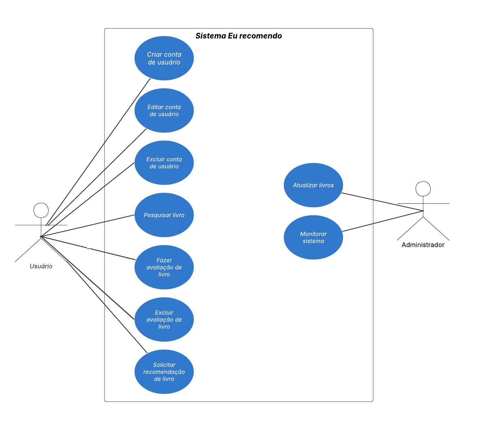

# 2.3.1 Diagrama de Caso de Uso

## O que é Diagrama de Caso de Uso?

 &emsp;&emsp;O Diagrama de Caso de Uso representa visualmente as interações entre os usuários e um sistema. Ele descreve "quem" utiliza o sistema e "o que" ele pode fazer, focando nas funcionalidades oferecidas e nas relações com os seus diversos utilizadores.

 &emsp;&emsp;Este diagrama captura os requisitos funcionais de um sistema, ou seja, as ações e serviços que ele deve executar para atender às necessidades dos usuários. Ele serve como uma ponte de comunicação entre a equipe de desenvolvimento e as partes interessadas (stakeholders), como clientes e usuários finais, por utilizar uma notação gráfica de fácil compreensão.

## Diagrama 

<b>Imagem 1</b> - Diagrama de Caso de Uso 

### Atores   
- **Administrador**: Administrador do sistema, responsável pelo monitoramento do sistema e atualização dos livros.  
- **Usuário**: Público-alvo do sistema, pode pesquisar livros, avaliá-los e solicitar recomendação de livros.

### 🗺️ Mapeamento de Casos de Uso  

| Ator                   | Casos de Uso                                 |
|------------------------|----------------------------------------------|
| Administrador          | UC08 - Atualizar livros     UC09 - Monitorar sistema                 |
| Usuário               | UC01 - Criar conta de usuário   UC02 - Editar conta de usuário   UC03 - Excluir conta de usuário    UC04 - Pesquisar livro   UC05 - Fazer avaliação de livro   UC06 - Excluir avaliação de livro   Solicitar recomendação de livro |

### Tabela 1: Especificação caso de uso 01: Criar conta de usuário

| Campo               | Descrição                                                                                             |
| ------------------- | ----------------------------------------------------------------------------------------------------- |
| *UC*              | Rastreabilidade do caso de uso: UC01                                                                                                 |
| *Descrição*       | Descrição do caso de uso|
| *Ator*            | Atores participantes   |
| *Pré-condições*   | Condições necessárias para a realização das tarefas do caso de uso|
| *Ação*            | Ação realizada pelos atores      |
| *Fluxo Principal* | Fluxo seguido pelos atores e sistema |
| *Fluxo Alternativo* |Fluxo alternativo ao fluxo principal |
| *Fluxo de Exceção*| Fluxo que ocorre quando uma exceção acontece no sistema|
| *Pós-condições*   | Comportamento do sistema após a execução do fluxo principal  |
| *Data de Criação* | Data da criação da especificação  |
<!-- | *Rastreabilidade* | Id do requisito associado ao caso de uso   | -->

### Tabela 2: Especificação caso de uso 02: Editar conta de usuário

| Campo               | Descrição                                                                                             |
| ------------------- | ----------------------------------------------------------------------------------------------------- |
| *UC*              | Rastreabilidade do caso de uso: UC02                                                                                                 |
| *Descrição*       | Descrição do caso de uso|
| *Ator*            | Atores participantes   |
| *Pré-condições*   | Condições necessárias para a realização das tarefas do caso de uso|
| *Ação*            | Ação realizada pelos atores      |
| *Fluxo Principal* | Fluxo seguido pelos atores e sistema |
| *Fluxo Alternativo* |Fluxo alternativo ao fluxo principal |
| *Fluxo de Exceção*| Fluxo que ocorre quando uma exceção acontece no sistema|
| *Pós-condições*   | Comportamento do sistema após a execução do fluxo principal  |
| *Data de Criação* | Data da criação da especificação  |
<!-- | *Rastreabilidade* | Id do requisito associado ao caso de uso   | -->

### Tabela 3: Especificação caso de uso 03: Excluir conta de usuário

| Campo               | Descrição                                                                                             |
| ------------------- | ----------------------------------------------------------------------------------------------------- |
| *UC*              | Rastreabilidade do caso de uso: UC03                                                                                                 |
| *Descrição*       | Este caso de uso permite que um Usuário exclua sua própria conta na plataforma EuRecomendo.|
| *Ator*            | Usuário   |
| *Pré-condições*   | Usuário logado em sua conta|
| *Ação*            | Exclusão da própria conta de usuário     |
| *Fluxo Principal* | 1. O usuário acessa a página “Configurações da Conta”.   2. O usuário seleciona a opção “Excluir Conta”.   3. O sistema apresenta uma mensagem de confirmação, explicando que não é possível desfazer essa ação.   4. O usuário confirma a exclusão inserindo sua senha. [FA01], [FA02]   5. O sistema valida as credenciais.   6. O sistema remove os dados do usuário do banco.   7. O sistema apresenta mensagem confirmando a exclusão e encerra a sessão do usuário. |
| *Fluxo Alternativo* | Não se aplica |
| *Fluxo de Exceção*| FA1 – Senha incorreta: No passo 4, se a senha estiver incorreta, o sistema informa o erro e solicita nova tentativa.   FA3 – Solicitação cancelada: No passo 4, o usuário pode desistir antes de confirmar, retornando às configurações sem excluir a conta.|
| *Pós-condições*   | A conta e todos os dados pessoais do usuário são removidos, perdendo acesso a todas as funcionalidades do sistema..  |
| *Data de Criação* | 20/09/25  |
<!-- | *Rastreabilidade* | Id do requisito associado ao caso de uso   | -->

### Tabela 4: Especificação caso de uso 04: Pesquisar livro

| Campo               | Descrição                                                                                             |
| ------------------- | ----------------------------------------------------------------------------------------------------- |
| *UC*              | Rastreabilidade do caso de uso: UC04                                                                                                 |
| *Descrição*       | Permite que o usuário pesquise livros por nome ou gênero, visualizando uma lista de resultados. |
| *Ator*            | Usuário   |
| *Pré-condições*   | Usuário está logado em sua conta|
| *Ação*            | Usuário clica em pesquisar e informar o nome ou gênero do livro que está buscando.     |
| *Fluxo Principal* | 1. O usuário acessa a página de busca.   2. O usuário digita o nome ou gênero do livro.   3. O sistema consulta o banco de dados pelos livros correspondentes. [FA01]   4. O sistema exibe a lista de livros ao usuário.   5. O usuário seleciona um livro.   6. O sistema recupera os detalhes do livro no banco de dados.   7. O sistema exibe as informações do livro (sinopse, autor/a, e avaliações dos outros usuários). |
| *Fluxo Alternativo* | Não se aplica |
| *Fluxo de Exceção*| FA01 - NNenhum livro encontrado: No passo 3, o sistema não encontra nenhum livro correspondente e retorna "Não foi encontrado livros para essa busca!" |
| *Pós-condições*   | O sistema apresenta as informações do livro selecionado ou notifica o usuário em caso de falha ou ausência de resultados.  |
| *Data de Criação* | 20/09/25  |
<!-- | *Rastreabilidade* | Id do requisito associado ao caso de uso   | -->

### Tabela 5: Especificação caso de uso 05: Fazer avaliação de livro

| Campo               | Descrição                                                                                             |
| ------------------- | ----------------------------------------------------------------------------------------------------- |
| *UC*              | Rastreabilidade do caso de uso: UC05                                                                                                 |
| *Descrição*       | Descrição do caso de uso|
| *Ator*            | Atores participantes   |
| *Pré-condições*   | Condições necessárias para a realização das tarefas do caso de uso|
| *Ação*            | Ação realizada pelos atores      |
| *Fluxo Principal* | Fluxo seguido pelos atores e sistema |
| *Fluxo Alternativo* |Fluxo alternativo ao fluxo principal |
| *Fluxo de Exceção*| Fluxo que ocorre quando uma exceção acontece no sistema|
| *Pós-condições*   | Comportamento do sistema após a execução do fluxo principal  |
| *Data de Criação* | Data da criação da especificação  |
<!-- | *Rastreabilidade* | Id do requisito associado ao caso de uso   | -->

### Tabela 6: Especificação caso de uso 06: Excluir avaliação de livro

| Campo               | Descrição                                                                                             |
| ------------------- | ----------------------------------------------------------------------------------------------------- |
| *UC*              | Rastreabilidade do caso de uso: UC06                                                                                                 |
| *Descrição*       | Descrição do caso de uso|
| *Ator*            | Atores participantes   |
| *Pré-condições*   | Condições necessárias para a realização das tarefas do caso de uso|
| *Ação*            | Ação realizada pelos atores      |
| *Fluxo Principal* | Fluxo seguido pelos atores e sistema |
| *Fluxo Alternativo* |Fluxo alternativo ao fluxo principal |
| *Fluxo de Exceção*| Fluxo que ocorre quando uma exceção acontece no sistema|
| *Pós-condições*   | Comportamento do sistema após a execução do fluxo principal  |
| *Data de Criação* | Data da criação da especificação  |
<!-- | *Rastreabilidade* | Id do requisito associado ao caso de uso   | -->

### Tabela 7: Especificação caso de uso 07: Solicitar recomendação de livro

| Campo               | Descrição                                                                                             |
| ------------------- | ----------------------------------------------------------------------------------------------------- |
| *UC*              | Rastreabilidade do caso de uso: UC07                                                                                                 |
| *Descrição*       | Descrição do caso de uso|
| *Ator*            | Atores participantes   |
| *Pré-condições*   | Condições necessárias para a realização das tarefas do caso de uso|
| *Ação*            | Ação realizada pelos atores      |
| *Fluxo Principal* | Fluxo seguido pelos atores e sistema |
| *Fluxo Alternativo* |Fluxo alternativo ao fluxo principal |
| *Fluxo de Exceção*| Fluxo que ocorre quando uma exceção acontece no sistema|
| *Pós-condições*   | Comportamento do sistema após a execução do fluxo principal  |
| *Data de Criação* | Data da criação da especificação  |
<!-- | *Rastreabilidade* | Id do requisito associado ao caso de uso   | -->

### Tabela 8: Especificação caso de uso 08: Atualizar livros

| Campo               | Descrição                                                                                             |
| ------------------- | ----------------------------------------------------------------------------------------------------- |
| *UC*              | Rastreabilidade do caso de uso: UC08                                                                                                 |
| *Descrição*       | Descrição do caso de uso|
| *Ator*            | Atores participantes   |
| *Pré-condições*   | Condições necessárias para a realização das tarefas do caso de uso|
| *Ação*            | Ação realizada pelos atores      |
| *Fluxo Principal* | Fluxo seguido pelos atores e sistema |
| *Fluxo Alternativo* |Fluxo alternativo ao fluxo principal |
| *Fluxo de Exceção*| Fluxo que ocorre quando uma exceção acontece no sistema|
| *Pós-condições*   | Comportamento do sistema após a execução do fluxo principal  |
| *Data de Criação* | Data da criação da especificação  |
<!-- | *Rastreabilidade* | Id do requisito associado ao caso de uso   | -->

### Tabela 9: Especificação caso de uso 09: Monitorar sistema

| Campo               | Descrição                                                                                             |
| ------------------- | ----------------------------------------------------------------------------------------------------- |
| *UC*              | Rastreabilidade do caso de uso: UC09                                                                                                 |
| *Descrição*       | Descrição do caso de uso|
| *Ator*            | Atores participantes   |
| *Pré-condições*   | Condições necessárias para a realização das tarefas do caso de uso|
| *Ação*            | Ação realizada pelos atores      |
| *Fluxo Principal* | Fluxo seguido pelos atores e sistema |
| *Fluxo Alternativo* |Fluxo alternativo ao fluxo principal |
| *Fluxo de Exceção*| Fluxo que ocorre quando uma exceção acontece no sistema|
| *Pós-condições*   | Comportamento do sistema após a execução do fluxo principal  |
| *Data de Criação* | Data da criação da especificação  |
<!-- | *Rastreabilidade* | Id do requisito associado ao caso de uso   | -->

## Histórico de Versionamento

| Versão | Data  | Descrição | Autor(es) | Revisor(es) |
|--------|-------|-----------|-----------|-------------|
|  `0.1` | 20/09 | Adição da estrutura do arquivo | [Sophia Silva](https://github.com/Sophiassilva)  | [Gabriel](https://github.com/GabrielCastelo-31) |
|  `0.2` | 20/09 | Adição do diagrama de casos de uso e introdução | [Sophia Silva](https://github.com/Sophiassilva)  | [Gabriel](https://github.com/GabrielCastelo-31) |
|  `0.3` | 20/09 | Especificação dos casos de uso 03 e 04 | [Sophia Silva](https://github.com/Sophiassilva)  | [Gabriel](https://github.com/GabrielCastelo-31) |
