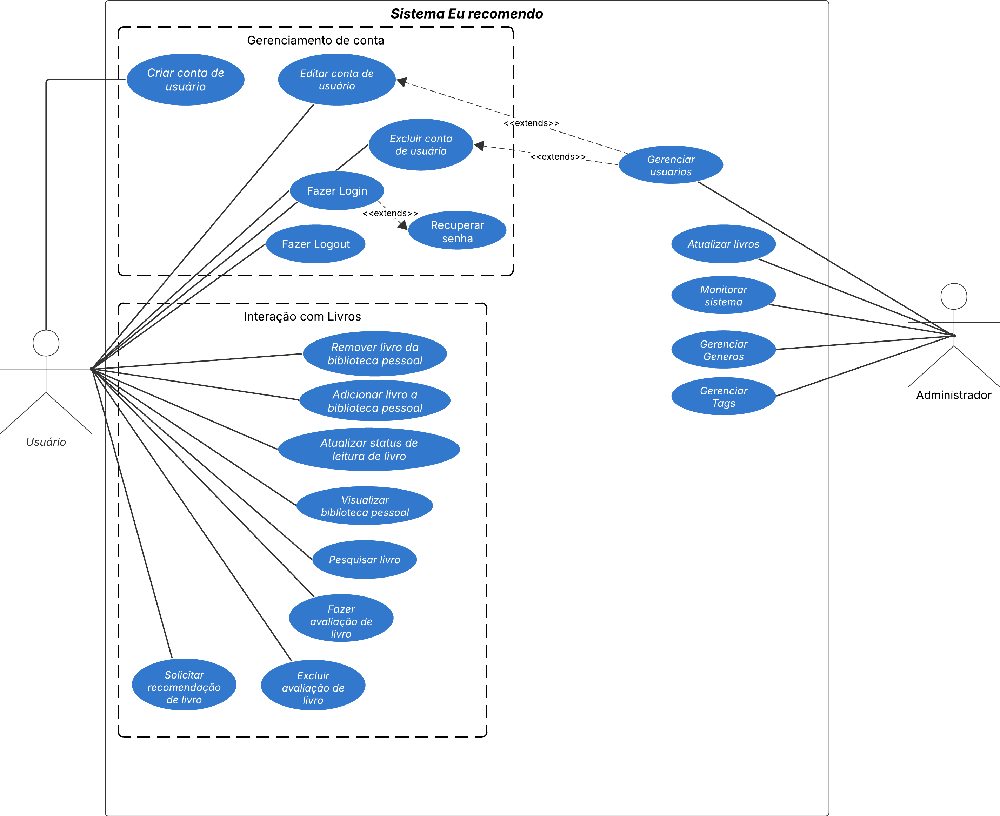

# 2.3.1 Diagrama de Caso de Uso

## O que é Diagrama de Caso de Uso?

 &emsp;&emsp;O Diagrama de Caso de Uso representa visualmente as interações entre os usuários e um sistema. Ele descreve "quem" utiliza o sistema e "o que" ele pode fazer, focando nas funcionalidades oferecidas e nas relações com os seus diversos utilizadores.

 &emsp;&emsp;Este diagrama captura os requisitos funcionais de um sistema, ou seja, as ações e serviços que ele deve executar para atender às necessidades dos usuários. Ele serve como uma ponte de comunicação entre a equipe de desenvolvimento e as partes interessadas (stakeholders), como clientes e usuários finais, por utilizar uma notação gráfica de fácil compreensão.

## Diagrama

<b>Imagem 1</b> - Diagrama de Caso de Uso 

### Atores
- **Administrador**: Administrador do sistema, responsável pelo monitoramento do sistema e atualização dos livros.
- **Usuário**: Público-alvo do sistema, pode pesquisar livros, avaliá-los e solicitar recomendação de livros.

### 🗺️ Mapeamento de Casos de Uso

| Ator                   | Casos de Uso                                 |
|------------------------|----------------------------        |
| Administrador          | UC08 - Atualizar livros     UC09 - Monitorar sistema                 |
| Usuário               | UC01 - Criar conta de usuário   UC02 - Editar conta de usuário   UC03 - Excluir conta de usuário    UC04 - Pesquisar livro   UC05 - Fazer avaliação de livro   UC06 - Excluir avaliação de livro   UC07 - Solicitar recomendação de livro |

### Tabela 1: Especificação caso de uso 01: Criar conta de usuário

| Campo               | Descrição                                                                                             |
| ------------------- | ----------------------------------------------------------------------------------------------------- |
| **UC**              | Rastreabilidade do caso de uso: UC01                                                                                                 |
| **Descrição**       | Este caso de uso descreve o fluxo realizado por um usuário para criar uma conta no site EuRecomendo. |
| **Ator**            | Usuário  |
| **Pré-condições**   | Acesso à internet e usuário não possuir conta no sistema|
| **Ação**            | Usuário clica no botão "Criar Conta"    |
| **Fluxo Principal** | 1. Usuário acessa a página inicial do site EuRecomendo   2. Usuário clica no botão “Criar Conta”. [FA02]   3. Sistema exibe formulário de cadastro com campos obrigatórios (nome, e-mail, senha, etc.). [FA02]   4. Usuário preenche os campos obrigatórios e confirma a criação da conta. [FA02],[FE02]   5. Sistema valida os dados informados. [FA01], [FE01],[FE02], [FE03]   6. Sistema cria a conta do usuário e exibe mensagem de sucesso. |
| **Fluxo Alternativo** |- **FA01**: Se o usuário já possuir uma conta, o sistema sugere o acesso pela tela de login.   - **FA02**: Caso o usuário não conclua o preenchimento e saia da página, o sistema descarta os dados temporários.|
| **Fluxo de Exceção**| - **FE01**: E-mail já cadastrado → Sistema exibe mensagem de erro e solicita uso de outro e-mail.   - **FE02**: Campos obrigatórios não preenchidos → Sistema solicita o preenchimento antes de prosseguir.  - **FE03**: Falha de conexão com o servidor → Sistema exibe mensagem de indisponibilidade temporária.|
| **Pós-condições**   | - Conta de usuário criada com sucesso e registrada no banco de dados.   - Usuário autenticado automaticamente e direcionado à página inicial personalizada.  |
| **Data de Criação** | 21/09/2025 |
<!-- | **Rastreabilidade** | Id do requisito associado ao caso de uso   | -->

### Tabela 2: Especificação caso de uso 02: Editar conta de usuário

| Campo               | Descrição                                                                                             |
| ------------------- | ----------------------------------------------------------------------------------------------------- |
| **UC**              | UC02 – Editar conta de usuário |
| **Descrição**       | Este caso de uso descreve o fluxo realizado por um usuário para editar os dados de sua conta já existente no site EuRecomendo. |
| **Ator**            | Usuário autenticado |
| **Pré-condições**   | - Usuário possuir conta já cadastrada no sistema. - Usuário estar autenticado no sistema. |
| **Ação**            | Usuário acessa a área **“Minha Conta”** e seleciona a opção **“Editar Conta”**. |
| **Fluxo Principal** | 1. Usuário acessa a área **“Minha Conta”**. 2. Usuário seleciona a opção **“Editar Conta”**. 3. Sistema exibe formulário com os dados atuais da conta. 4. Usuário altera os campos desejados (ex.: nome, senha, preferências, etc.) [FA01][FA02]. 5. Usuário confirma a edição [FA02]. 6. Sistema valida os dados inseridos [FE01][FE02]. 7. Sistema atualiza as informações no banco de dados e exibe mensagem de confirmação de sucesso [FE03]. |
| **Fluxo Alternativo** | - **FA01:** Usuário acessa a tela de edição, mas não realiza alterações → Sistema mantém os dados atuais ao sair da tela. - **FA02:** Usuário decide cancelar antes de confirmar → Sistema descarta as alterações e retorna à página **“Minha Conta”**. |
| **Fluxo de Exceção**| - **FE01:** Campos obrigatórios deixados em branco → Sistema solicita preenchimento antes de salvar. - **FE02:** Senha informada não atende aos critérios de segurança → Sistema exibe mensagem de erro. - **FE03:** Falha de conexão com o servidor durante a atualização → Sistema exibe mensagem de indisponibilidade temporária. |
| **Pós-condições**   | - Informações da conta do usuário são atualizadas com sucesso. - Sistema mantém registro da última atualização dos dados. |
| **Data de Criação** | 21/09/2025|
<!-- | **Rastreabilidade** | Id do requisito associado ao caso de uso   | -->

### Tabela 3: Especificação caso de uso 03: Excluir conta de usuário

| Campo               | Descrição                                                                                             |
| ------------------- | ----------------------------------------------------------------------------------------------------- |
| **UC**              | Rastreabilidade do caso de uso: UC03                                                                                                 |
| **Descrição**       | Este caso de uso permite que um Usuário exclua sua própria conta na plataforma EuRecomendo.|
| **Ator**            | Usuário   |
| **Pré-condições**   | Usuário logado em sua conta|
| **Ação**            | Exclusão da própria conta de usuário     |
| **Fluxo Principal** | 1. O usuário acessa a página “Configurações da Conta”.   2. O usuário seleciona a opção “Excluir Conta”.   3. O sistema apresenta uma mensagem de confirmação, explicando que não é possível desfazer essa ação.   4. O usuário confirma a exclusão inserindo sua senha. [FE01], [FE02]   5. O sistema valida as credenciais.   6. O sistema remove os dados do usuário do banco.   7. O sistema apresenta mensagem confirmando a exclusão e encerra a sessão do usuário. |
| **Fluxo Alternativo** | Não se aplica |
| **Fluxo de Exceção**| - **FE01**: Senha incorreta: No passo 4, se a senha estiver incorreta, o sistema informa o erro e solicita nova tentativa.   - **FE02**: Solicitação cancelada: No passo 4, o usuário pode desistir antes de confirmar, retornando às configurações sem excluir a conta.|
| **Pós-condições**   | A conta e todos os dados pessoais do usuário são removidos, perdendo acesso a todas as funcionalidades do sistema..  |
| **Data de Criação** | 20/09/25  |
<!-- | **Rastreabilidade** | Id do requisito associado ao caso de uso   | -->

### Tabela 4: Especificação caso de uso 04: Pesquisar livro

| Campo               | Descrição                                                                                             |
| ------------------- | ----------------------------------------------------------------------------------------------------- |
| **UC**              | Rastreabilidade do caso de uso: UC04                                                                                                 |
| **Descrição**       | Permite que o usuário pesquise livros por nome ou gênero, visualizando uma lista de resultados. |
| **Ator**            | Usuário   |
| **Pré-condições**   | Usuário está logado em sua conta|
| **Ação**            | Usuário clica em pesquisar e informar o nome ou gênero do livro que está buscando.     |
| **Fluxo Principal** | 1. O usuário acessa a página de busca.   2. O usuário digita o nome ou gênero do livro.   3. O sistema consulta o banco de dados pelos livros correspondentes. [FE01]   4. O sistema exibe a lista de livros ao usuário.   5. O usuário seleciona um livro.   6. O sistema recupera os detalhes do livro no banco de dados.   7. O sistema exibe as informações do livro (sinopse, autor/a, e avaliações dos outros usuários). |
| **Fluxo Alternativo** | Não se aplica |
| **Fluxo de Exceção**| - **FE01**: Nenhum livro encontrado: No passo 3, o sistema não encontra nenhum livro correspondente e retorna "Não foi encontrado livros para essa busca!" |
| **Pós-condições**   | O sistema apresenta as informações do livro selecionado ou notifica o usuário em caso de falha ou ausência de resultados.  |
| **Data de Criação** | 20/09/25  |
<!-- | **Rastreabilidade** | Id do requisito associado ao caso de uso   | -->

### Tabela 5: Especificação caso de uso 05: Fazer avaliação de livro

| Campo               | Descrição                                                                                             |
| ------------------- | ----------------------------------------------------------------------------------------------------- |
| **UC**              | Rastreabilidade do caso de uso: UC05                                                                  |
| **Descrição**       | Permite que o usuário avalie um livro do catálogo, atribuindo uma nota e, opcionalmente, um comentário, a partir da página de detalhes do livro. |
| **Ator**            | Usuário autenticado                                                                                   |
| **Pré-condições**   | Usuário autenticado no sistema; livro existente no catálogo.                                          |
| **Ação**            | Usuário seleciona a opção “Avaliar” em um livro, preenche os campos e confirma o envio.               |
| **Fluxo Principal** | 1. Usuário acessa a página do livro.   2. Usuário seleciona a opção “Avaliar”.   3. Sistema exibe formulário de avaliação com campo Nota (obrigatório) e Comentário (opcional). [FA01]   4. Usuário informa a nota e, opcionalmente, um comentário, e confirma o envio. [FA02]   5. Sistema valida os dados informados. [FE01][FE02][FE03]   6. Sistema registra a avaliação e exibe mensagem de sucesso. |
| **Fluxo Alternativo** | - **FA01:** Usuário abandona a ação antes de enviar → Sistema descarta dados não persistidos.   - **FA02:** Usuário cancela antes de confirmar → Sistema retorna à página do livro sem alterações. |
| **Fluxo de Exceção**| - **FE01:** Campos obrigatórios não preenchidos → Sistema solicita o preenchimento antes de prosseguir.   - **FE02:** Valor de nota inválido → Sistema exibe mensagem de erro e impede o envio.   - **FE03:** Falha de conexão com o servidor → Sistema exibe mensagem de indisponibilidade temporária. |
| **Pós-condições**   | Avaliação do usuário registrada e exibida na página do livro; em caso de falha, nenhuma alteração é persistida. |
| **Data de Criação** | 21/09/2025 |

### Tabela 6: Especificação caso de uso 06: Excluir avaliação de livro

| Campo               | Descrição                                                                                             |
| ------------------- | ----------------------------------------------------------------------------------------------------- |
| **UC**              | Rastreabilidade do caso de uso: UC06                                                                  |
| **Descrição**       | Permite que o usuário exclua a própria avaliação registrada em um livro.                              |
| **Ator**            | Usuário autenticado                                                                                   |
| **Pré-condições**   | Usuário autenticado; avaliação existente associada ao usuário no livro em questão.                    |
| **Ação**            | Usuário seleciona a opção “Excluir” na sua avaliação e confirma a exclusão.                           |
| **Fluxo Principal** | 1. Usuário localiza a própria avaliação na página do livro ou em “Minha Conta”.   2. Usuário seleciona “Excluir avaliação”.   3. Sistema apresenta diálogo de confirmação.   4. Usuário confirma a exclusão. [FA01][FE01]   5. Sistema verifica a autoria. [FE02]   6. Sistema exclui a avaliação e registra a operação.   7. Sistema exibe mensagem de sucesso e remove a avaliação da listagem. |
| **Fluxo Alternativo** | - **FA01:** Usuário cancela a exclusão → Sistema mantém a avaliação sem alterações. |
| **Fluxo de Exceção**| - **FE01:** Avaliação não encontrada → Sistema informa o erro e não realiza alterações.   - **FE02:** Usuário não é o autor da avaliação → Sistema bloqueia a ação e informa falta de permissão.   - **FE03:** Falha de conexão com o servidor → Sistema exibe mensagem de indisponibilidade temporária. |
| **Pós-condições**   | Avaliação removida da visualização do livro; em caso de falha, nenhuma alteração é persistida.        |
| **Data de Criação** | 21/09/2025 |

### Tabela 7: Especificação caso de uso 07: Solicitar recomendação de livro

| Campo               | Descrição                                                                                             |
| ------------------- | ----------------------------------------------------------------------------------------------------- |
| **UC**              | Rastreabilidade do caso de uso: UC07                                                                  |
| **Descrição**       | Permite que o usuário solicite uma lista de livros recomendados pelo sistema.                         |
| **Ator**            | Usuário autenticado                                                                                   |
| **Pré-condições**   | Usuário autenticado no sistema.                                                                       |
| **Ação**            | Usuário acessa a seção de recomendações e solicita recomendações.                                     |
| **Fluxo Principal** | 1. Usuário acessa a seção “Recomendações”.   2. Usuário aciona “Solicitar recomendação”.   3. Sistema processa a solicitação. [FE01][FE02]   4. Sistema exibe a lista de livros recomendados.   5. Usuário, se desejar, seleciona um livro.   6. Sistema apresenta a página de detalhes do livro selecionado. |
| **Fluxo Alternativo** | Não se aplica |
| **Fluxo de Exceção**| - **FE01:** Nenhuma recomendação disponível → Sistema informa ausência de recomendações no momento.   - **FE02:** Falha de conexão com o servidor → Sistema exibe mensagem de indisponibilidade temporária. |
| **Pós-condições**   | Lista de recomendações apresentada ao usuário ou mensagem informativa em caso de indisponibilidade.   |
| **Data de Criação** | 21/09/2025 |

### Tabela 8: Especificação caso de uso 08: Atualizar livros

| Campo               | Descrição                                                                                             |
| ------------------- | ----------------------------------------------------------------------------------------------------- |
| **UC**              | Rastreabilidade do caso de uso: UC08                                                                  |
| **Descrição**       | Permite que o administrador atualize os registros de livros do catálogo do sistema.                    |
| **Ator**            | Administrador                                                                                         |
| **Pré-condições**   | Administrador autenticado no sistema.                                                                 |
| **Ação**            | Administrador acessa o módulo “Atualizar livros”, altera os dados necessários e confirma a atualização.|
| **Fluxo Principal** | 1. Administrador acessa o módulo “Atualizar livros”.   2. Sistema exibe a listagem de livros.   3. Administrador seleciona um livro para atualizar ou inicia a inclusão de um novo. [FA01]   4. Sistema exibe formulário com dados do livro.   5. Administrador altera os campos e confirma.   6. Sistema valida os dados informados. [FE01][FE02]   7. Sistema salva as alterações e exibe mensagem de sucesso. |
| **Fluxo Alternativo** | - **FA01:** Administrador cancela antes de confirmar → Sistema descarta alterações e retorna à listagem. |
| **Fluxo de Exceção**| - **FE01:** Campos obrigatórios não preenchidos → Sistema solicita o preenchimento antes de salvar.   - **FE02:** Falha de conexão com o servidor → Sistema exibe mensagem de indisponibilidade temporária. |
| **Pós-condições**   | Registros de livros atualizados no sistema; em caso de falha, nenhuma alteração é persistida.          |
| **Data de Criação** | 21/09/2025 |

### Tabela 9: Especificação caso de uso 09: Monitorar sistema

| Campo               | Descrição                                                                                             |
| ------------------- | ----------------------------------------------------------------------------------------------------- |
| **UC**              | Rastreabilidade do caso de uso: UC09                                                                                                 |
| **Descrição**       | Descrição do caso de uso|
| **Ator**            | Atores participantes   |
| **Pré-condições**   | Condições necessárias para a realização das tarefas do caso de uso|
| **Ação**            | Ação realizada pelos atores      |
| **Fluxo Principal** | Fluxo seguido pelos atores e sistema |
| **Fluxo Alternativo** |Fluxo alternativo ao fluxo principal |
| **Fluxo de Exceção**| Fluxo que ocorre quando uma exceção acontece no sistema|
| **Pós-condições**   | Comportamento do sistema após a execução do fluxo principal  |
| **Data de Criação** | Data da criação da especificação  |
<!-- | **Rastreabilidade** | Id do requisito associado ao caso de uso   | -->

## Histórico de Versionamento

| Versão | Data  | Descrição | Autor(es) | Revisor(es) |
|--------|-------|-----------|-----------|-------------|
|  `0.1` | 20/09 | Adição da estrutura do arquivo | [Sophia Silva](https://github.com/Sophiassilva)  | [Gabriel Castelo](https://github.com/GabrielCastelo-31) |
|  `0.2` | 20/09 | Adição do diagrama de casos de uso e introdução | [Sophia Silva](https://github.com/Sophiassilva)  | [Gabriel Castelo](https://github.com/GabrielCastelo-31) |
|  `0.3` | 20/09 | Especificação dos casos de uso 03 e 04 | [Sophia Silva](https://github.com/Sophiassilva)  | [Gabriel Castelo](https://github.com/GabrielCastelo-31) |
|  `0.4` | 21/09 | Especificação dos casos de uso 01 e 02 | [Gabriel Castelo](https://github.com/GabrielCastelo-31) | [Sophia Silva](https://github.com/Sophiassilva) |
| `0.5` | 21/09 |Corrije erros de digitação e padroniza identificação dos fluxos de exceção e alternativo.| [Gabriel Castelo](https://github.com/GabrielCastelo-31) | [Sophia Silva](https://github.com/Sophiassilva) |
| `0.6` | 21/09 |Adiciona nova versao do Diagrama de casos de uso com a adicao de novos casos de uso| [Pedro Braga](https://github.com/Stain19), [Gabriel Castelo](https://github.com/GabrielCastelo-31) | [Henrique Quenino](https://github.com/henriquecq) |
| `0.7` | 21/09 | Adiciona especificacao dos acasos de uso 05, 06, 07 e 08| [Pedro Braga](https://github.com/Stain19), [Henrique Quenino](https://github.com/henriquecq) | [Gabriel Castelo](https://github.com/GabrielCastelo-31) |
