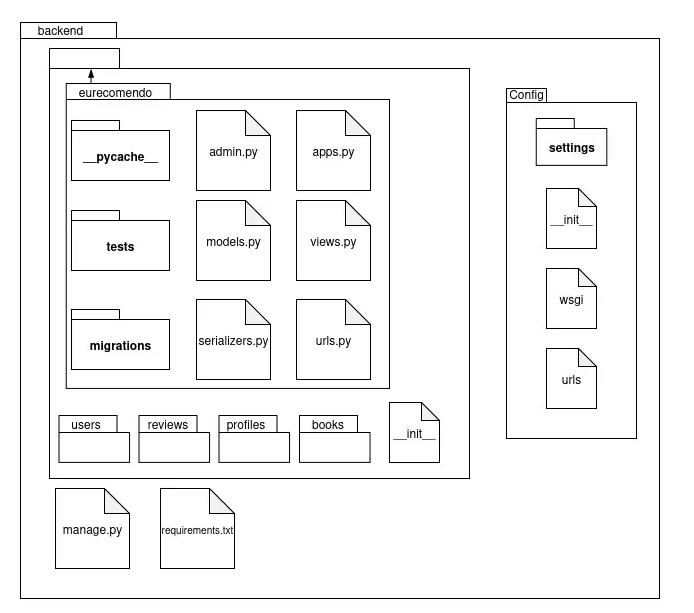

# 2.3.1 Diagrama de Pacotes

## O que é Diagrama de Pacotes?

 &emsp;&emsp;O Diagrama de Pacotes é uma ferramenta da UML (Unified Modeling Language) utilizada para organizar e representar a estrutura modular de um sistema de software. Ele mostra como os elementos do sistema são agrupados em pacotes (packages) e as dependências entre esses pacotes, proporcionando uma visão de alto nível da arquitetura organizacional do projeto.

 &emsp;&emsp;Este tipo de diagrama é fundamental para entender a divisão lógica do sistema, facilitando a compreensão da organização do código, a identificação de responsabilidades e a análise de dependências entre diferentes módulos. No contexto do sistema o diagrama de pacotes ilustra como os componentes estão estruturados para suportar as funcionalidades de recomendação de livros.

## Objetivo

 &emsp;&emsp;O objetivo do Diagrama de Pacotes é apresentar a organização estrutural do sistema EuRecomendo, destacando a divisão em camadas (Frontend, Backend) e a organização interna de cada uma delas. O diagrama auxilia na compreensão da arquitetura do software, facilitando a manutenção, evolução e onboarding de novos desenvolvedores no projeto.

## Metodologia

 &emsp;&emsp;A construção do Diagrama de Pacotes foi realizada de forma colaborativa pela equipe, seguindo uma análise detalhada da arquitetura proposta nos artefatos anteriores. O processo incluiu:

1. **Análise da Arquitetura Existente**: Estudo dos diagramas de implantação e componentes já desenvolvidos
2. **Identificação de Módulos**: Mapeamento dos principais pacotes e suas responsabilidades
3. **Definição de Dependências**: Análise das relações e dependências entre pacotes
4. **Validação com a Equipe**: Revisão colaborativa para garantir precisão e completude
5. **Documentação**: Elaboração da documentação explicativa de cada pacote

## Arquitetura do Sistema EuRecomendo

### Visão Geral da Estrutura

O sistema EuRecomendo foi projetado seguindo uma arquitetura em camadas, organizando-se nos seguintes pacotes principais:
  -Frontend
  -Backend

## Diagrama

Figunra 1: Diagrama de Pacotes do Sistema EuRecomendo.

*[Diagrama será inserido aqui]*

Autores: [A ser definido pela equipe]. 

 

## Descrição Detalhada dos Pacotes

### BackEnd

Figura 2: Diagrama de Pacotes do Backend.

 

Autores: Euller Júlio e Luis Lima. 

 

**apps** : cada app tem uma pasta com as suas models, views, formulários, testes, templates e arquivos estáticos. Além disso, também há um arquivo URLs que será incluso no URLs global.

**Users**: App para as funcionalidades de usuário para o frameWork django.

**Profiles**: App para as funcionalidades de usuário do sistema.

**Reviews**: App para as funcionalidades de Avaliacoes/Resenhas do sistema.

**Books**: App para as funcionalidades de Livros do sistema.

**migrations** : pasta com as migrações para o banco de dados.

**tests** : aorquivos de testes referente ao app.

**models** : arquivos de models do app.

**views** : arquivos de views do app.

**admin** : arquivo de conexão do app com o admin.

**urls.py** : arquivo que mapeia as as views com templates de cada app.

**__init__** : arquivo que transforma o app em um pacote python.

**apps** : mapeia a pasta que o contém como um app.

**config** : pasta com as configurações do projeto Django REST.

**urls.py** : inclui todos os URLs.py dos apps.

**settings** : arquivos com as configurações básicas da aplicação.

**wsgi** : especificação para uma interface simples e universal entre servidores web e aplicações web.

**manage.py** : arquivo criado automaticamente pelo Django REST para gerênciamento de comandos.

**requirements** : organiza todos os pacotes/componentes que a aplicação utiliza em arquivos.

### Frontend

Figura 3: Diagrama de Pacotes do Frontend.

Autores:  

 

**assets:** Arquivos estáticos (imagens, ícones, fontes).

**components:** Componentes reutilizáveis de UI.

**stores:** Gerenciamento de estado (Pinia ou Vuex).

**router:** Arquivo ou módulo de roteamento (index.js ou router.js).

**styles:** Configurações do Tailwind (tailwind.config.js).

**App.vue:** Componente raiz da aplicação.

**main.js:** Ponto de entrada da aplicação (instancia o Vue, router e store).

**index.html:** Serve como template para o Vite injetar o bundle final de JavaScript. Contém a div #app, onde o Vue monta a aplicação.

**vite.config.js:** Arquivo de configuração do Vite. Define plugins, resoluções de caminho, configurações de build e integração com frameworks.

**package.json:** Arquivo de metadados e dependências do projeto.

**package-lock.json:** Arquivo de bloqueio de dependências gerado pelo NPM. Garante que todas as instalações usem as mesmas versões exatas de bibliotecas.

## Bibliografia

> 
UML Package Diagrams Overview. *https://www.uml-diagrams.org/package-diagrams.html*.

> 
FOWLER, Martin. UML Distilled: A Brief Guide to the Standard Object Modeling Language. 3ª ed. Boston: Addison-Wesley, 2003.

> 
LARMAN, Craig. Utilizando UML e Padrões: Uma Introdução à Análise e ao Projeto Orientados a Objetos. 3ª ed. Porto Alegre: Bookman, 2007.

> 
Clean Architecture Principles. *https://blog.cleancoder.com/uncle-bob/2012/08/13/the-clean-architecture.html*.

## Participantes

| Nome                      |
|---------------------------|
| [Bruno Bragança](https://github.com/BrunoBReis) |
| [Euller Júlio](https://github.com/Potatoyz908)  |
| [José Eduardo Prado](https://github.com/jevprado) |
| [Luis Lima](https://github.com/luidooo) |
| [Tiago Antunes](https://github.com/TiagoBalieiro) | 

## Histórico de Versionamento

| Versão | Data  | Descrição | Autor(es) | Revisor(es) |
|--------|-------|-----------|-----------|-------------|
|  `1.0` | 20/09 | Estrutura inicial da página (Introdução, Bibliografia, objetivo, participantes e metodologia) | [Euller Júlio](https://github.com/Potatoyz908) | [Tiago](https://github.com/TiagoBalieiro), [José](https://github.com/jevprado), [Iago](https://github.com/iagorrr), [Sophia](https://github.com/Sophiassilva)  |
|  `1.1` | 20/09 | Estrutura inicial dos pacotes | [Luis Lima](https://github.com/luidooo) | [Euller Júlio](https://github.com/Potatoyz908) |
|  `1.2` | 21/09 | Ajuste na descrição detalhada dos pacotes do diagrama de pacotes referente ao backend | [Euller Júlio](https://github.com/Potatoyz908) | [Luis Lima](https://github.com/luidooo) |
|  `1.3` | 21/09 | Descrição detalhada dos pacotes do diagrama de pacotes referente ao frontend | [Jose Eduardo Prado](https://github.com/jevprado) | [Tiago Antunes](https://github.com/TiagoBalieiro) |
