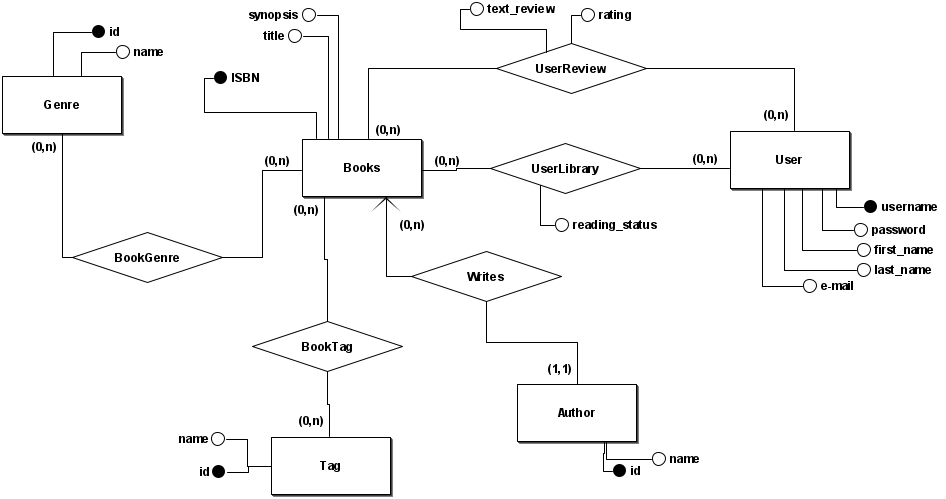

# 2.5.1 Modelagem Conceitual do Banco de Dados

## Introdução
A modelagem conceitual do banco de dados é uma etapa crucial no desenvolvimento de sistemas, pois define a estrutura lógica dos dados e suas inter-relações, independentemente do sistema de gerenciamento de banco de dados (SGBD) que será utilizado. Esta seção descreve o processo de criação do modelo conceitual para o sistema EuRecomendo, destacando os principais componentes e suas relações.

## Objetivo
O objetivo da modelagem conceitual do banco de dados é criar um modelo abstrato que represente de forma clara e precisa os dados necessários para o funcionamento do sistema EuRecomendo. Este modelo servirá como base para a implementação física do banco de dados, garantindo que todas as necessidades de armazenamento e recuperação de informações sejam atendidas.

## Diagrama Entidade-Relacionamento (DER)

Abaixo está o Diagrama Entidade-Relacionamento (DER) que ilustra as entidades principais do sistema EuRecomendo, seus atributos e os relacionamentos entre elas.

### Descrição das Entidades e Relacionamentos

#### Books
- **ISBN** (chave primária)
- **title** (título do livro)
- **synopsis** (sinopse do livro)

Relacionamentos:
- Possui gêneros (BookGenre)
- Possui tags (BookTag)
- É escrito por (Writes → Author)
- Pode estar em bibliotecas de usuários (UserLibrary)
- Pode receber avaliações de usuários (UserReview)

---

#### Genre
- **id** (chave primária)
- **name** (nome do gênero)

Relacionamentos:
- Associado a livros por meio de **BookGenre** (0,n)

---

#### Tag
- **id** (chave primária)
- **name** (nome da tag)

Relacionamentos:
- Associado a livros por meio de **BookTag** (0,n)

---

#### Author
- **id** (chave primária)
- **name** (nome do autor)

Relacionamentos:
- Escreve livros (**Writes**) — obrigatoriamente (1,1)

---

#### User
- **username** (chave primária)
- **password** (senha)
- **first_name** (primeiro nome)
- **last_name** (sobrenome)
- **e-mail** (endereço de e-mail)

Relacionamentos:
- Mantém uma biblioteca de livros (**UserLibrary**)
- Pode escrever avaliações de livros (**UserReview**)

---

#### UserLibrary
- **reading_status** (status de leitura: lido, lendo, desejado, etc.)

Relacionamentos:
- Relaciona **User** (0,n) com **Books** (0,n)

---

#### UserReview
- **text_review** (texto da avaliação)
- **rating** (nota atribuída ao livro)

Relacionamentos:
- Relaciona **User** (0,n) com **Books** (0,n)

---

#### Entidades Associativas
- **BookGenre** → relação entre **Books** e **Genre**
- **BookTag** → relação entre **Books** e **Tag**
- **Writes** → relação entre **Books** e **Author**

## Referências
> UNIVERSIDADE DE BRASÍLIA. Modelagem de Dados. Disponível em: https://sae.unb.br/cae/conteudo/unbfga/sbd/new_bancomodelagem.html
## Histórico de Versionamento

| Versão | Data  | Descrição | Autor(es) | Revisor(es) |
|--------|-------|-----------|-----------|-------------|
|  `0.1` | 20/09 | Adição da modelagem conceitual do banco de dados| [Gabriel Castelo](https://github.com/GabrielCastelo-31)  | [Gabriel Castelo](https://github.com/GabrielCastelo-31) | [Bruno Bragança](https://github.com/BrunoBReis)   |
